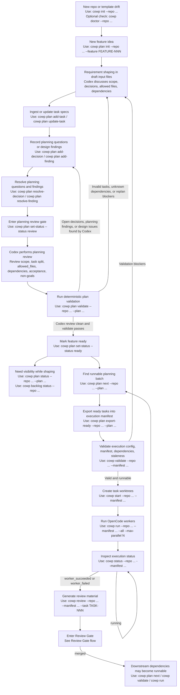
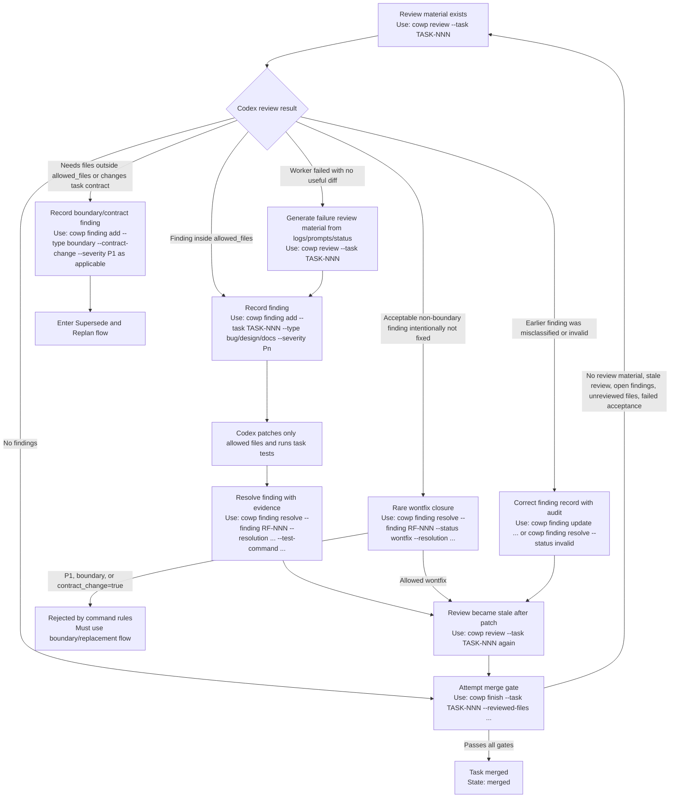
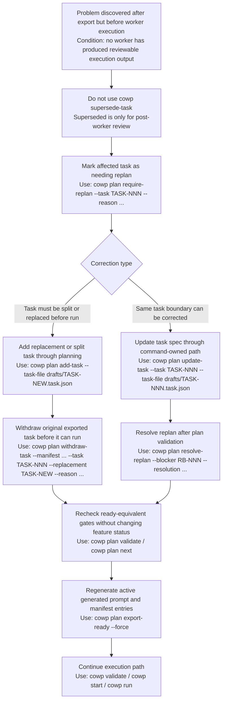
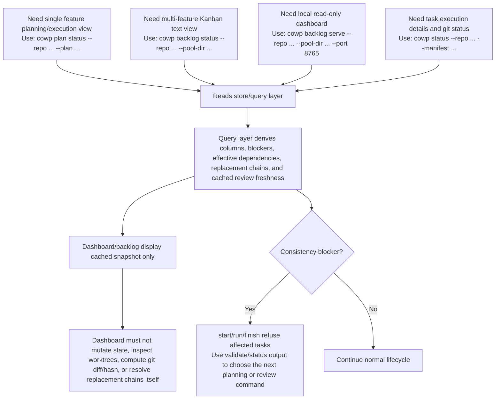

# Codex OpenCode WorkerPool v2.3 Phased Workflow Hardening Plan

## Summary

v2.3 focuses on productionizing the code review stage after a worker finishes.

The goal is not to make `cowp` decide whether code is good. Codex remains the controller and makes engineering judgments. The goal is to make the review gate durable and enforceable:

- Code review findings are recorded in structured state.
- Open findings block `cowp finish`.
- Dashboard shows why a task is blocked in review.
- Dashboard uses visual status cues so running, failed, blocked, and human-intervention states are easier to spot.
- Review after a patch must be refreshed before merge.
- Boundary problems are explicit instead of living only in chat history.
- Plan, manifest, and state access goes through a centralized store/query layer so dependency, replacement, and completion rules are not duplicated across runner, planning, status, and Dashboard code.

## Problem

In the current flow, `cowp review` generates review material, but review findings are mostly handled by Codex discipline:

- Codex reviews the diff.
- Codex decides whether to patch inside `allowed_files`.
- Codex decides whether a finding requires returning to planning.
- Codex remembers not to run `finish` while unresolved findings exist.

This worked in the TASK-017 smoke test, but it is fragile across long threads, context compaction, restarts, and multiple features.

## v2.3 Scope

Add an execution-level review findings state machine.

In scope:

- Add structured review findings to `runs_root/state.json`.
- Add CLI commands to add and resolve review findings.
- Make `finish` refuse tasks with open review findings.
- Make `finish` refuse tasks without a generated review diff.
- Track a review snapshot hash so review becomes stale after further code edits.
- Show review blockers and finding details in Dashboard and `cowp status`.
- Add Dashboard status colors, subtle running animation, and explicit attention hints for states requiring Codex/user action.
- Introduce a centralized WorkerPool store/query API for plan JSON, manifest JSON, and execution state reads/writes.
- Add an explicit `superseded` terminal state for execution tasks that cannot be completed inside their allowed-file boundary.
- Add replacement metadata so a superseded task can point at a new task created with `cowp plan add-task`.
- Make WorkerPool state command-owned: Codex as controller chooses and runs `cowp` commands, but does not hand-edit plan JSON, execution manifests, generated prompts, backlog snapshots, or run state.
- Route dependency, runnable, mergeable, feature-completion, and Dashboard column decisions through the query layer.
- Add an explicit planning command to link a superseded task to its replacement and record `replacement_contract`.
- Add planning mutation commands for adding/updating tasks and requiring/resolving downstream replan.
- Add planning gate commands for decisions, planning findings, and feature status transitions so planning state is also command-owned.
- Add a narrow pre-run withdrawal command for exported tasks that have not produced reviewable worker output and have explicit same-feature replacement tasks.
- Block already-exported downstream tasks whose declared dependencies include superseded tasks until their prompts are re-exported from the current effective dependency mapping.
- Update README, RUNBOOK, templates, and tests.

Out of scope for v2.3:

- Automatic boundary widening.
- Automatic task abandonment.
- Automatic planning rollback.
- Automatic replacement task creation.
- Automatic downstream dependency rewriting.
- Automatic inference that a replacement task is contract-compatible.
- One-to-many or cross-feature execution supersede replacement. Pre-run `withdraw-task` may reference multiple same-feature split tasks because it is a planning correction before worker review exists.
- LLM-based review generation.
- Replacing Codex judgment with tool decisions.
- Generic `abandon-task`; v2.3 only allows explicit pre-run `withdraw-task` for exported tasks with no reviewable worker output and at least one valid same-feature replacement task.

## Delivery Phases

The full design is intentionally larger than the first review-gate hardening
milestone. Do not implement the whole document as one migration. Deliver it in
small, separately accepted phases:

### v2.3.0 Review And Finish Gate

Goal:

- Make execution review durable without migrating the whole workflow engine.

Scope:

- Keep `cowp review --task` backward-compatible.
- Add `cowp finding add`, `cowp finding update`, and `cowp finding resolve`.
- Add `task_review_findings`, `task_audit_events`, and review freshness fields.
- Make `cowp finish` reject no review material, stale review, open findings,
  active boundary findings, active `contract_change: true` findings, disallowed
  `wontfix`, unreviewed files, and superseded/withdrawn tasks when those states
  already exist.
- Make worker acceptance and main acceptance unable to mutate reviewed code past
  the review gate.
- Make finish transaction-safe with `git merge --no-ff --no-commit` and explicit
  retry semantics.
- Add the minimal Dashboard/status visibility for `Review Blocked` and finding
  details.

Acceptance:

- Existing no-finding review/finish flow still passes.
- Findings block finish until resolved or audited as invalid/reclassified.
- Worker acceptance mutations make finish refuse and require a fresh review.
- Main acceptance failure leaves the base branch unchanged and retry semantics
  are deterministic.
- Dashboard/status can show review blockers without computing git diffs.

### v2.3.1 Query And Dependency Migration

Goal:

- Move duplicated workflow decisions behind shared store/query functions.

Scope:

- Centralized plan/manifest/state loaders and writers.
- Shared queries for dependency blockers, run eligibility, merge eligibility,
  review freshness, declared/effective dependencies, and feature completion.
- Manifest dependency metadata and stale-prompt detection.
- Preserve old manifests and old state files.

Acceptance:

- Runner, status, validate, and backlog use the shared query layer for the
  migrated decisions.
- `worker_succeeded` is no longer treated as dependency-satisfied.
- Already-exported downstream tasks with stale dependency metadata stay blocked
  until re-exported.

### v2.3.2 Replacement, Withdrawal, And Dashboard Polish

Goal:

- Add the broader planning/execution correction flows after the review gate and
  query layer are stable.

Scope:

- `cowp supersede-task`.
- `cowp plan link-replacement`.
- Replacement contract handling and replacement chains.
- Narrow exported-task-only `cowp plan withdraw-task`.
- Planning mutation/replan commands needed by replacement and withdrawal flows.
- Dashboard/status details for superseded, withdrawn, replacement chains,
  dependency differences, and visual polish.

Acceptance:

- Superseded tasks are non-mergeable and can complete only through valid
  same-feature replacement chains.
- Withdrawn tasks are accepted only for exported pre-run tasks with valid
  replacement tasks.
- Dashboard displays replacement/withdrawal detail from cached backlog snapshots
  and remains read-only.

## Terminology

Planning review finding:

- Lives in feature plan JSON.
- Applies before worker execution.
- Blocks ready/export.

Execution review finding:

- Lives in run state for a specific task.
- Applies after worker execution.
- Blocks finish/merge.

Declared dependency:

- The literal task id listed in a plan or manifest `depends_on`.

Effective dependency:

- The dependency after applying explicit replacement metadata.
- Example: `TASK-020 depends_on TASK-017`, and `TASK-017 superseded_by TASK-018` with `replacement_contract: compatible`, so the effective dependency can be `TASK-018`.

Superseded task:

- A terminal, non-mergeable task that was exported or run but cannot be completed safely inside its task boundary.
- It does not satisfy dependencies by itself.
- It may point to a replacement task that must re-enter planning review, ready, export, worker execution, and Codex review.

Withdrawn task:

- A pre-run planning correction for an exported task that should not execute.
- It is allowed only before reviewable worker output exists.
- It must record one or more same-feature replacement tasks, but it is not the same as execution `superseded`.

Completion-satisfied task:

- A task that should count as complete for feature completion.
- A normal task is completion-satisfied only when its execution state is `merged`.
- A superseded task is completion-satisfied only through a valid same-feature replacement chain whose terminal task is completion-satisfied.
- A withdrawn task is completion-satisfied only when no active task depends on it and each declared withdrawal replacement task is completion-satisfied.
- Cycles in supersede or withdrawal replacement chains are consistency blockers.

Use explicit names in code/docs to avoid confusion:

- `plan.review_findings`
- `task_review_findings`

## Centralized Store And Query Layer

v2.3 should stop scattering raw JSON interpretation across modules.

Only dedicated store modules should read or write:

- plan JSON
- execution manifest JSON
- `runs_root/state.json`

All workflow decisions should call query functions instead of directly interpreting raw dictionaries or dataclass fields in each module.

## Controller Command Boundary

Codex remains the controller, but controller authority means choosing the next
valid workflow command, not hand-editing WorkerPool state files.

Command-owned WorkerPool state:

- feature plan JSON
- execution manifest JSON
- generated task prompts under the control directory `tasks/`; legacy in-repo mode may use `.codex-workerpool/tasks/`
- `runs_root/state.json`
- backlog/status snapshots consumed by Dashboard
- review finding, replan, replacement, and prompt freshness metadata

Rules:

- Codex must not directly edit command-owned WorkerPool state files.
- State changes must go through `cowp` commands, and those commands must use the store/write APIs.
- Codex may author draft requirement text, design notes, or task spec input files, but planning mutation/gate commands such as `cowp plan add-task`, `cowp plan update-task`, `cowp plan set-status`, and `cowp plan export-ready` must ingest or render them into command-owned state.
- Every state-changing command should append an audit event with command name, task ids, reason, timestamp, and before/after summary. Planning mutations write plan `audit_events`; execution/review mutations write task `task_audit_events`.
- Dashboard remains read-only and never writes WorkerPool state.
- Store modules may expose write functions, but direct writes should be reachable only from command handlers and tests.

Required query responsibilities:

- `get_task_state(task_id)`
- `get_declared_dependencies(task_id)`
- `get_effective_dependencies(task_id)`
- `get_dependency_blockers(task_id)`
- `is_dependency_satisfied(task_id)`
- `is_task_runnable(task_id)`
- `is_task_mergeable(task_id)`
- `is_task_terminal(task_id)`
- `is_task_completion_satisfied(task_id)`
- `get_replacement(task_id)`
- `get_replacement_chain(task_id)`
- `get_original_task(task_id)`
- `get_supersede_findings(task_id)`
- `get_task_review_findings(task_id)`
- `get_task_audit_events(task_id)`
- `get_finish_attempts(task_id)`
- `get_review_freshness(task_id)`
- `get_withdrawal_replacements(task_id)`
- `get_planning_decisions(feature_id)`
- `get_planning_findings(feature_id)`
- `get_replan_blockers(task_id)`
- `get_declared_downstream_tasks(task_id)`
- `get_effective_downstream_tasks(task_id)`
- `get_prompt_refresh_blockers(task_id)`
- `get_consistency_blockers(task_id)`
- `is_feature_done(feature_id)`
- `get_task_column(task_id)`

Rules centralized in this layer:

- Only `merged` satisfies a dependency.
- `worker_succeeded` means "ready for Codex review"; it does not satisfy downstream dependencies.
- `superseded` never satisfies a dependency by itself.
- A replacement chain can satisfy a dependency only when every replacement edge explicitly records `replacement_contract: compatible` and the terminal replacement task is `merged`.
- If `replacement_contract` is `unknown` or `changed`, downstream tasks are blocked until `cowp plan update-task` changes the downstream dependency or `cowp plan link-replacement` records a compatible contract.
- If an already-exported downstream task declares a dependency on a superseded task, `replacement_contract: compatible` alone is not enough to run it.
- Already-exported downstream tasks remain blocked until `cowp plan export-ready --force` re-exports prompts from the current effective dependency mapping.
- Feature completion ignores a superseded task only when it has a valid same-feature replacement chain and the terminal replacement task is completion-satisfied.
- A superseded task with no linked replacement is a valid transitional state, but it blocks feature completion and all downstream tasks.
- A linked replacement task may itself be superseded later. In that case, the replacement chain is blocked until a new task is created with `cowp plan add-task` and linked with `cowp plan link-replacement`.
- Open execution review findings on a superseded task remain audit records. They keep the superseded task non-mergeable, but they do not block the replacement task once the replacement path is valid.
- A withdrawn planning task is a pre-run planning correction. It is terminal for planning, non-runnable, non-mergeable, never dependency-satisfied, and ignored for feature completion only after all downstream dependencies have been updated away from it and all declared withdrawal replacement tasks are completion-satisfied by the normal feature-completion rules.
- Feature completion uses `is_task_completion_satisfied`; dependency satisfaction still uses only `merged` or a compatible effective replacement whose terminal task is `merged`.
- Dashboard and CLI status read derived snapshot/query results; they do not reimplement dependency or replacement logic.
- The query layer does not require planning status and execution status to be equal. It derives workflow state from both layers.
- When an exported task is superseded in execution, the plan task normally keeps `status: exported`; planning records replacement metadata separately.
- State is the execution fact source; plan JSON is the planning fact source. If replacement metadata and execution state contradict each other, query/validate/status/Dashboard must expose an inconsistency blocker instead of silently choosing one side.
- v2.3 execution supersede replacement metadata is one-to-one and same-feature only. Linear same-feature supersede chains are allowed; fan-out, fan-in, cycles, and cross-feature supersede replacement are not.
- `plan export-ready` writes executable prompts and manifest entries from effective dependencies, while preserving declared dependency information for audit/status display.
- If declared and effective dependencies differ, the prompt must show both and explain the replacement mapping.
- A task whose exported prompt was generated before a replacement mapping changed is stale and not runnable until re-exported.
- Exported manifest entries must store enough dependency metadata for staleness checks, including declared dependency ids, effective dependency ids, and a dependency mapping hash that reflects the replacement chain used at export time.
- `cowp validate`, `cowp start`, and `cowp run` must use query-layer dependency and staleness checks so they agree on runnable tasks.
- `cowp validate`, `cowp start`, `cowp run`, and `cowp finish` must refuse tasks affected by plan/state consistency blockers.

This also fixes the current inconsistency where planning/backlog require dependency tasks to be `merged`, while runner currently treats `worker_succeeded` as dependency-satisfying.

## Command And Scenario Flowcharts

These diagrams describe the controller workflow from the Codex point of view.
Codex may write draft requirement/design/task input files, but command-owned
WorkerPool state changes only through the `cowp` commands shown in the nodes.

### Main Lifecycle



### Review Gate



### Supersede, Replacement, And Replan

```mermaid
flowchart TD
  A["Boundary or contract finding after worker execution<br/>Condition: task cannot finish safely inside boundary"] --> B["Make original execution task terminal<br/>Use: cowp supersede-task --task OLD --finding RF-NNN --reason ..."]
  B --> C["Original task is non-mergeable<br/>Plan task usually remains status=exported"]
  C --> D["Create replacement through planning<br/>Use: cowp plan add-task --task-file drafts/NEW.task.json --reason ..."]
  D --> E["Link old and replacement<br/>Use: cowp plan link-replacement --task OLD --replacement NEW --contract unknown, changed, or compatible"]
  E --> F{"Replacement contract"}

  F -->|compatible| G["Unexported downstream may resolve effective dependency through NEW<br/>Dependency still satisfied only after terminal replacement is merged"]
  G --> H{"Was downstream already exported?"}
  H -->|No| I["Keep downstream in planning/export path<br/>Use: cowp plan validate / cowp plan next / cowp plan export-ready"]
  H -->|Yes| J["Refresh stale worker prompt and manifest<br/>Use: cowp plan export-ready --force"]

  F -->|changed or unknown| K["Downstream assumptions must be reviewed<br/>Use: cowp plan require-replan --task DOWNSTREAM --blocked-by OLD --reason ..."]
  K --> L["Change downstream task contract or dependency<br/>Use: cowp plan update-task --task DOWNSTREAM --task-file drafts/DOWNSTREAM.task.json"]
  L --> M["Close one replan blocker with audit<br/>Use: cowp plan resolve-replan --blocker RB-NNN --resolution ..."]
  M --> N{"Was downstream already exported?"}
  N -->|No| I
  N -->|Yes| J

  J --> O["Execution layer can run only after refreshed prompt, valid dependencies, and merged effective dependency<br/>Use: cowp validate / cowp start / cowp run"]
  I --> O

  O --> P["Replacement worker finishes<br/>Use: cowp review --task NEW"]
  P --> Q{"Replacement review result"}
  Q -->|Passes finish gate| R["Merge replacement<br/>Use: cowp finish --task NEW --reviewed-files ..."]
  Q -->|Replacement also boundary-blocked| S["Create linear same-feature replacement chain<br/>Use: cowp supersede-task NEW<br/>Then cowp plan add-task NEXT<br/>Then cowp plan link-replacement from NEW to NEXT"]
  S --> F
  R --> T["Feature completion and downstream readiness are derived by query layer"]
```



### Pre-run Planning Correction



### Observation And Dashboard



## State Model

Extend each task state with:

```json
{
  "task_branch_base_sha": "def456",
  "review_status": "generated",
  "review_diff_path": "runs/TASK-017/review.diff",
  "review_snapshot_hash": "sha256-of-status-and-diff",
  "current_snapshot_hash": "sha256-of-current-status-and-diff",
  "status": "superseded",
  "superseded_reason": null,
  "superseded_at": null,
  "superseded_finding_ids": ["RF-001"],
  "task_review_findings": [
    {
      "id": "RF-001",
      "status": "open",
      "severity": "P1",
      "type": "boundary",
      "contract_change": true,
      "message": "Requires src/ainotes/api/reviews.py outside allowed_files",
      "created_at": "...",
      "resolved_at": null,
      "resolution": null,
      "test_command": null,
      "test_exit_code": null,
      "evidence": null
    }
  ],
  "task_audit_events": [
    {
      "id": "TAE-001",
      "command": "cowp finding update",
      "task_ids": ["TASK-017"],
      "finding_id": "RF-001",
      "reason": "Initial boundary classification was too broad",
      "created_at": "...",
      "before": {"type": "boundary", "severity": "P1", "contract_change": true},
      "after": {"type": "bug", "severity": "P2", "contract_change": false}
    }
  ],
  "finish_attempts": [
    {
      "id": "FA-001",
      "status": "main_acceptance_failed",
      "base_commit_sha": "def456",
      "parent_task_commit_sha": null,
      "task_commit_sha": "abc123",
      "covered_commit_range": "def456..abc123",
      "review_snapshot_hash": "sha256-of-status-and-diff",
      "acceptance_command": "& '.\\.venv\\Scripts\\python.exe' -m pytest -q",
      "exit_code": 1,
      "failure_detail": "main acceptance failed",
      "merge_aborted": true,
      "merge_commit_sha": null,
      "created_at": "..."
    }
  ]
}
```

Execution audit events:

- `task_audit_events` is the v2.3 audit log for execution/review mutations.
- `cowp finding add`, `cowp finding update`, `cowp finding resolve`, and
  `cowp supersede-task` append task audit events.
- `finish_attempts` is the only structured source for finish retry and merge
  gate decisions. It records concrete base/task commit SHAs, the review snapshot
  hash verified before those task commits, merge or main-acceptance failure
  details, and whether the base-branch merge was aborted.
- `task_audit_events` records the human-readable audit trail for display and
  troubleshooting. Commands must not use task audit events as the authoritative
  source for retry, freshness, or merge eligibility decisions.
- `finish_attempts[].status` values:
  - `merge_conflict`
  - `main_acceptance_failed`
  - `merged`
- Failed attempts that happen after a task commit is created record
  `base_commit_sha`, `task_commit_sha`, `parent_task_commit_sha`,
  `covered_commit_range`, `review_snapshot_hash`, `failure_detail`,
  merge/main-acceptance exit details, and whether the merge was aborted.
- Successful attempts record `status: merged`, `task_commit_sha`,
  `base_commit_sha`, `parent_task_commit_sha`, `covered_commit_range`,
  `review_snapshot_hash`, and `merge_commit_sha`.
- `covered_commit_range` describes the reviewed task-branch commits covered by
  that attempt. The range must use concrete SHAs, not branch names. For the first
  task commit it is usually `base_commit_sha..task_commit_sha`. For appended
  repair commits it is usually
  `parent_task_commit_sha..task_commit_sha`.
- Worker acceptance failures, reviewed-file check failures, stale review
  refusals, and other failures before a task commit exists do not create
  `finish_attempts[]` entries. They append `task_audit_events` only, because
  there is no task commit SHA or covered commit range to retry.
- `task_branch_base_sha` is the concrete branch-point SHA recorded when `cowp`
  creates the task branch/worktree. Until `cowp finish` creates the reviewed task
  commit, the task branch `HEAD` must remain equal to this SHA. Worker-created or
  manual pre-finish commits are rejected by `cowp review` and first-attempt
  `cowp finish`.
- Finding records store current finding state; historical before/after details
  live in `task_audit_events` instead of per-finding `history[]`.
- Status and Dashboard may display the latest relevant audit event for a finding,
  but must not reconstruct workflow eligibility from Dashboard-side history
  parsing.

Finding statuses:

- `open`
- `resolved`
- `wontfix`
- `invalid`

Finding severities:

- `P1`
- `P2`
- `P3`

Finding types:

- `bug`
- `test_gap`
- `boundary`
- `design`
- `docs`
- `other`

For v2.3, `wontfix` counts as closed only when it includes a resolution/evidence string.
`invalid` is reserved for audit-backed review mistakes, such as a finding that
does not actually apply after Codex rechecks the diff. It requires a non-empty
reason/evidence string and must not be used to bypass a real boundary or contract
finding.
`contract_change` is explicit. Commands must not infer it from prose.

Execution task status additions:

- `superseded`

`superseded_at` records when Codex/controller marks the execution task as superseded.

`superseded_finding_ids` uses reference-only storage. It points to
`task_review_findings[].id` values in the same `TaskState`; the query layer must
validate that the referenced findings exist and expose resolved finding details
to status/Dashboard.

The field may be empty for unusual cases where no finding was recorded before
superseding, but status/Dashboard should show a warning. If the field contains
ids that do not exist in `task_review_findings`, validation fails.

Plan-level command-owned state:

```json
{
  "status": "ready",
  "open_decisions": [
    {
      "id": "D-001",
      "status": "open",
      "question": "Should category search be exact or scope-based?",
      "created_at": "...",
      "resolved_at": null,
      "resolution": null
    }
  ],
  "review_findings": [
    {
      "id": "F-001",
      "status": "open",
      "severity": "P1",
      "finding": "TASK-020 depends on output shape that changed in replacement TASK-018",
      "contract_change": true,
      "created_at": "...",
      "resolved_at": null,
      "resolution": null
    }
  ],
  "replan_blockers": [
    {
      "id": "RB-001",
      "status": "open",
      "task": "TASK-020",
      "blocked_by": "TASK-017",
      "reason": "TASK-017 was superseded by TASK-018 with changed output contract",
      "created_at": "...",
      "resolved_at": null,
      "resolution": null
    }
  ],
  "audit_events": [
    {
      "id": "AE-001",
      "command": "cowp plan require-replan",
      "task_ids": ["TASK-020"],
      "reason": "TASK-017 was superseded",
      "created_at": "...",
      "before": {"status": "exported"},
      "after": {"replan_blocker": "RB-001"}
    }
  ]
}
```

Plan id prefixes:

- Decisions use `D-NNN`.
- Planning findings use `F-NNN`.
- Replan blockers use `RB-NNN`.
- Plan audit events use `AE-NNN`.
- Task execution/review audit events use `TAE-NNN`.
- Finish attempts use `FA-NNN`.

Planning task statuses:

- `draft`
- `review`
- `blocked`
- `ready`
- `exported`
- `withdrawn`

`draft`, `review`, `ready`, and `exported` are normal active task planning
statuses. `blocked` is a legacy compatible active task status. New v2.3 flows
should prefer explicit decisions, planning findings, and replan blockers over
creating new task-level `blocked` states. `withdrawn` is the v2.3 terminal
pre-run task status.

Withdrawn task metadata:

```json
{
  "id": "TASK-017",
  "status": "withdrawn",
  "withdrawn_at": "...",
  "withdrawn_reason": "Split into TASK-021 and TASK-022 before worker execution",
  "withdrawn_replacement_tasks": ["TASK-021", "TASK-022"]
}
```

`withdrawn` is planning-owned and is only valid before a worker produces
reviewable execution output. It is not the same as execution `superseded`.
Withdrawn tasks do not satisfy dependencies. If any active task still declares a
dependency on a withdrawn task, the query layer reports a blocker until that task
is updated or withdrawn too.

`withdrawn_replacement_tasks` is required for v2.3 withdrawals. It records the
active same-feature task or tasks that replace the withdrawn task's intended
scope. This keeps `withdraw-task` from becoming a generic abandonment path.

Plan task replacement metadata:

```json
{
  "id": "TASK-017",
  "status": "exported",
  "superseded_by": "TASK-018",
  "replacement_contract": "compatible"
}
```

Plan task status is not changed when an exported task is superseded in execution.
`status: exported` remains the planning-layer fact that the task passed ready
gate and was copied into execution.

Replacement contract values:

- `compatible`: downstream dependency contracts remain valid and may resolve to the replacement task.
- `changed`: downstream tasks must be reviewed and updated before they can run.
- `unknown`: default; downstream tasks remain blocked until planning confirms compatibility.

`replacement_contract` is per replacement edge. If a dependency resolves through
multiple superseded tasks, every edge in that chain must be `compatible`; any
`unknown` or `changed` edge blocks effective dependency resolution.

New replacement tasks should use normal planning task fields plus:

```json
{
  "id": "TASK-018",
  "replaces": "TASK-017"
}
```

Manifest dependency metadata:

```json
{
  "id": "TASK-020",
  "depends_on": ["TASK-018"],
  "declared_depends_on": ["TASK-017"],
  "dependency_mapping_hash": "sha256-of-declared-effective-replacement-chain-contracts"
}
```

For execution, `depends_on` contains effective dependency ids. The additional
metadata lets query/status detect stale prompts when replacement metadata changes
after export.

Manifest withdrawn metadata:

```json
{
  "id": "TASK-017",
  "active": false,
  "withdrawn": true,
  "withdrawn_at": "...",
  "withdrawn_reason": "Split into TASK-021 and TASK-022 before worker execution",
  "withdrawn_replacement_tasks": ["TASK-021", "TASK-022"]
}
```

`cowp start`, `cowp run`, and `cowp finish` must skip or refuse inactive
withdrawn manifest entries. The entry remains for audit and status visibility.

`cowp plan export-ready --force` must preserve inactive withdrawn manifest
entries and must not regenerate prompts for withdrawn tasks. If `--task` points
to a withdrawn task, `export-ready` refuses with a clear error.

## CLI Changes

### Review Command Compatibility

The existing review material command remains a leaf command for backward
compatibility:

```powershell
cowp review --repo <repo> --pool-dir <pool> --manifest tasks.json --task TASK-017
```

v2.3 must not convert `cowp review` into an argparse command group in a way that
breaks existing scripts. Review state mutations use separate commands:

- `cowp finding add`
- `cowp finding update`
- `cowp finding resolve`
- `cowp supersede-task`

If a future version adds `cowp review generate`, it must be an alias for the
existing `cowp review --task` behavior, not a replacement.

Review mutation audit rule:

- `cowp finding add`, `cowp finding update`, `cowp finding resolve`, and
  `cowp supersede-task` append `task_audit_events`.
- Audit events include command name, task ids, optional finding id, reason or
  resolution, timestamp, and before/after summary.
- The current finding record remains the source for current finding status;
  `task_audit_events` is the source for how that state changed.

### Add Finding

```powershell
cowp finding add `
  --repo <repo> `
  --pool-dir <pool> `
  --manifest tasks.json `
  --task TASK-017 `
  --severity P1 `
  --type boundary `
  --contract-change `
  --message "Requires src/ainotes/api/reviews.py outside allowed_files"
```

Behavior:

- Generates next finding id, e.g. `RF-001`.
- Appends finding to task state.
- Leaves task execution status unchanged.
- Records `contract_change: true` only when `--contract-change` is present; commands must not infer it from text.
- Dashboard derives review blocked state from open findings subject to the centralized column priority.

### Resolve Finding

```powershell
cowp finding resolve `
  --repo <repo> `
  --pool-dir <pool> `
  --manifest tasks.json `
  --task TASK-017 `
  --finding RF-001 `
  --resolution "Implemented within allowed files by changing notes scope query" `
  --test-command "& '.\.venv\Scripts\python.exe' -m pytest -q" `
  --test-exit-code 0
```

Behavior:

- Marks finding resolved.
- Requires non-empty resolution.
- Records optional test/evidence metadata.

### Update Finding

```powershell
cowp finding update `
  --repo <repo> `
  --pool-dir <pool> `
  --manifest tasks.json `
  --task TASK-017 `
  --finding RF-001 `
  --type bug `
  --severity P2 `
  --clear-contract-change `
  --reason "Initial boundary classification was too broad; fix stays inside allowed_files"
```

Behavior:

- Reclassifies an existing finding without closing it.
- Requires a non-empty reason.
- Records before/after metadata in the audit trail.
- May set `contract_change: true` with `--contract-change` or clear it with
  `--clear-contract-change`; commands must reject passing both flags together.
- Allows Codex to correct a mistaken `boundary` or `contract_change` classification without forcing a supersede path.
- Must not be used after the task is `merged` or `superseded`.

### Optional Wontfix

```powershell
cowp finding resolve `
  --task TASK-017 `
  --finding RF-002 `
  --status wontfix `
  --resolution "Accepted because endpoint remains intentionally exact for v2.3"
```

Behavior:

- Counts as closed only with explicit resolution.

Restrictions:

- `wontfix` must not close `boundary` findings.
- `wontfix` must not close findings with `contract_change: true`.
- `wontfix` must not close `P1` findings unless a future explicit risk-acceptance command is added.

### Invalid Finding

```powershell
cowp finding resolve `
  --task TASK-017 `
  --finding RF-003 `
  --status invalid `
  --resolution "Finding was based on an outdated diff; current review material does not contain this issue"
```

Behavior:

- Closes a finding only when Codex determines the finding itself was erroneous.
- Requires a non-empty resolution and audit event.
- Does not require a test command unless Codex uses a test as evidence.
- Does not allow hiding a real `boundary` or `contract_change` finding; if the issue is real but the classification was wrong, use `cowp finding update` first.

### Supersede Task

```powershell
cowp supersede-task `
  --repo <repo> `
  --pool-dir <pool> `
  --manifest tasks.json `
  --task TASK-017 `
  --finding RF-001 `
  --reason "Requires files outside allowed_files; split task again in planning"
```

Behavior:

- Marks the execution task as `superseded`.
- Records `superseded_reason`, `superseded_at`, and optional `superseded_finding_ids`.
- Validates each supplied finding id against `task_review_findings` for the same task.
- Leaves review findings and review material available for audit.
- Makes the task permanently non-mergeable.
- Makes `cowp start --all`, `cowp run --all`, and `cowp finish` skip or refuse the task.
- Does not create a replacement task automatically.
- Does not delete the task worktree or branch automatically.

Follow-up planning rule:

- Codex creates a new replacement task by running `cowp plan add-task` with a new task id.
- The old plan task keeps its planning status, usually `exported`.
- `cowp plan link-replacement` records `superseded_by`, `replacement_contract`, and reciprocal `replaces`.
- If downstream task assumptions are affected, Codex runs `cowp plan require-replan` for those downstream tasks.
- Downstream dependencies are either updated with `cowp plan update-task` or mapped through a `replacement_contract: compatible` chain; in both cases they remain blocked until the effective or terminal dependency is merged.
- If a downstream task has already been exported, Codex runs `cowp plan export-ready --force` after replan is resolved so the worker prompt and manifest use the current effective dependency mapping before it can run.

### Link Replacement

```powershell
cowp plan link-replacement `
  --repo <repo> `
  --pool-dir <pool> `
  --plan plans/FEATURE-001.plan.json `
  --task TASK-017 `
  --replacement TASK-018 `
  --contract unknown
```

Behavior:

- Updates only planning metadata.
- Keeps the old task planning status unchanged, usually `exported`.
- Writes `TASK-017.superseded_by = TASK-018`.
- Writes `TASK-017.replacement_contract = unknown|changed|compatible`.
- Writes `TASK-018.replaces = TASK-017`.
- Validates that both tasks exist in the same feature plan.
- Validates that the old task execution state is `superseded`.
- Validates one-to-one replacement for v2.3.
- Validates reciprocal replacement metadata.
- Rejects replacement cycles.
- Rejects changing an existing replacement link to a different task; rerunning the command with the same task/replacement pair may update only `replacement_contract`.
- Rejects replacement targets that are already `superseded` at link time.
- Rejects replacement targets whose planning task status is already `withdrawn` at link time.
- Does not create replacement tasks automatically.
- Does not rewrite downstream `depends_on` automatically.

If a linked replacement task is superseded later, create the next replacement as a
new planning task with `cowp plan add-task`, then link the superseded replacement
to that new task with `cowp plan link-replacement`. The query layer resolves the
resulting linear chain only when all links are same-feature, acyclic, reciprocal,
and `compatible`.

Contract update:

```powershell
cowp plan link-replacement `
  --repo <repo> `
  --pool-dir <pool> `
  --plan plans/FEATURE-001.plan.json `
  --task TASK-017 `
  --replacement TASK-018 `
  --contract compatible
```

`replacement_contract` is planning-owned. Execution commands must not infer or
change it automatically.

Downstream prompt refresh rule:

- For downstream tasks that are not exported yet, `replacement_contract: compatible` may allow effective dependency resolution through the replacement task.
- Effective dependency resolution is not the same as dependency satisfaction; the effective or terminal replacement task must still reach `merged`.
- For downstream tasks already exported into the execution manifest, effective dependency resolution is not enough.
- Already-exported downstream tasks must be re-exported with `cowp plan export-ready --force` so the prompt and execution manifest are regenerated from current effective dependencies before `cowp run` treats them as runnable.
- Staleness is detected by comparing the manifest dependency metadata with the current query-layer dependency mapping.
- This keeps worker prompts from silently relying on stale dependency contracts.

### Planning Gate Commands

```powershell
cowp plan add-decision `
  --repo <repo> `
  --pool-dir <pool> `
  --plan plans/FEATURE-001.plan.json `
  --question "Should category search be exact or scope-based?" `
  --reason "Need user/product decision before ready gate"
```

```powershell
cowp plan resolve-decision `
  --repo <repo> `
  --pool-dir <pool> `
  --plan plans/FEATURE-001.plan.json `
  --decision D-001 `
  --resolution "Use scope query for parent categories and exact path for leaf categories"
```

```powershell
cowp plan add-finding `
  --repo <repo> `
  --pool-dir <pool> `
  --plan plans/FEATURE-001.plan.json `
  --severity P1 `
  --contract-change `
  --finding "TASK-020 depends on output shape that changed in replacement TASK-018"
```

```powershell
cowp plan resolve-finding `
  --repo <repo> `
  --pool-dir <pool> `
  --plan plans/FEATURE-001.plan.json `
  --finding F-001 `
  --resolution "Updated TASK-020 prompt and acceptance to consume TASK-018 output"
```

```powershell
cowp plan set-status `
  --repo <repo> `
  --pool-dir <pool> `
  --plan plans/FEATURE-001.plan.json `
  --status ready `
  --reason "Codex planning review is clean and plan validation passes"
```

Behavior:

- Mutates planning decisions, planning findings, and feature status only through the store/write API.
- Allocates decision ids (`D-001`) and planning finding ids (`F-001`) deterministically.
- Requires non-empty question/finding/resolution/reason text.
- Records planning finding `contract_change: true` only when `--contract-change` is present.
- Refuses `ready` while open decisions, open planning findings, invalid tasks, unknown dependencies, or replan blockers exist.
- Refuses `exported`; only `cowp plan export-ready` may set exported task status or generated execution artifacts.
- Refuses `done` unless the query layer reports feature completion.
- Records audit events for every planning gate mutation.

Planning review gate rule:

- `cowp plan set-status --status review` only enters the planning review gate; it must not be treated as an automatic prelude to `ready`.
- Between `review` and `ready`, Codex performs the engineering review of scope, task split, `allowed_files`, dependencies, acceptance criteria, non-goals, and worker prompt clarity.
- If Codex finds design issues or unresolved questions, it records them with `cowp plan add-decision` or `cowp plan add-finding`, then resolves them through the matching resolve commands.
- `cowp plan validate` is a deterministic gate check, not a replacement for Codex's planning review.
- `ready` should be set only after Codex review is clean and `cowp plan validate` passes.

`cowp plan validate` should check objective workflow constraints:

- plan JSON and task spec shape
- duplicate or invalid task ids
- missing prompt/task references
- unknown dependencies and dependency cycles
- invalid or empty `allowed_files`
- open decisions, open planning findings, and open replan blockers
- withdrawn/superseded/replacement metadata consistency
- stale exported prompts or manifest dependency metadata

`cowp plan validate` should not decide subjective engineering quality, such as whether the product behavior is desirable, whether task boundaries are well chosen, or whether acceptance criteria fully capture user intent. Those remain Codex controller review responsibilities.

Feature status state machine:

| Current | Command | Target | Conditions |
| --- | --- | --- | --- |
| `draft` | `cowp plan set-status` | `review` | At least one active task exists. |
| `review` | `cowp plan set-status` | `reviewed` | Codex has completed planning review; optional compatibility state for existing plans. |
| `review` or `reviewed` | `cowp plan set-status` | `ready` | Codex planning review is clean, `cowp plan validate` passes, and no open decisions, open planning findings, invalid tasks, unknown dependencies, or replan blockers remain. |
| `ready` | `cowp plan export-ready` | `exported` | At least one ready task is exported; command owns generated prompts and manifest entries. |
| `exported` | `cowp plan set-status` | `done` | Query layer reports feature completion. |
| any non-`done` | `cowp plan set-status` | `blocked` | Requires non-empty reason and audit event. |
| `blocked` | `cowp plan set-status` | previous non-terminal planning status | Requires non-empty reason and no blockers that would make the target invalid. |

Status transition rules:

- `cowp plan set-status` refuses direct `exported`; only `cowp plan export-ready` owns export.
- `cowp plan set-status` refuses `done` unless query-layer feature completion is true.
- Backward transitions from `ready` or `exported` to earlier planning states are refused; use `cowp plan require-replan`, `cowp plan update-task`, `cowp plan resolve-replan`, and `cowp plan export-ready --force`.
- `withdrawn` is a task status, not a feature status.

Task planning status state machine:

| Current | Command | Target | Conditions |
| --- | --- | --- | --- |
| missing | `cowp plan add-task` | `draft` | Task id is valid and unique; feature membership, dependencies, allowed files, and prompt references validate. |
| `draft` | `cowp plan update-task` | `review` | Task spec is complete enough for Codex planning review; command records before/after task spec summary. |
| `review` | `cowp plan update-task` | `ready` | Codex planning review is clean for this task, `cowp plan validate` passes for affected plan scope, and no open decisions, planning findings, invalid dependencies, or replan blockers affect the task. |
| `ready` | `cowp plan export-ready` | `exported` | Command renders the active prompt and manifest entry from the current task spec and effective dependency mapping. |
| `exported` | `cowp plan update-task` | `exported` | Allowed only with an open replan blocker; updates task spec while preserving export/execution audit metadata and leaves prompt/manifest stale until `cowp plan export-ready --force`. |
| `exported` | `cowp plan export-ready --force` | `exported` | Refreshes active generated prompt/manifest entries after replan or dependency mapping changes. |
| `blocked` | `cowp plan update-task` | `draft`, `review`, or `ready` | Legacy compatibility path; requires a reason, no unresolved blocker that would make the target invalid, and an audit event. |
| `exported` | `cowp plan withdraw-task` | `withdrawn` | Only before reviewable worker output; requires at least one valid same-feature replacement task and records withdrawal metadata. |
| `withdrawn` | any start/run/finish/export command | refused | Withdrawn tasks are terminal, non-runnable, non-mergeable, and must not be re-exported. |

Task status transition rules:

- Task status changes are command-owned. Codex may prepare draft task spec files,
  but `cowp plan add-task`, `cowp plan update-task`, `cowp plan export-ready`,
  and `cowp plan withdraw-task` are the supported mutation paths.
- `cowp plan update-task` must refuse task status regressions unless an open
  replan blocker requires the correction and the command records an audit event.
- `blocked` is loaded and displayed for compatibility, but new v2.3 workflows
  should not use it as the main blocking mechanism. Command-owned blockers should
  be represented as decisions, planning findings, or replan blockers.
- `cowp plan export-ready` is the only command that may set task status to
  `exported` or write active generated prompts/manifests.
- `cowp plan withdraw-task` is the only command that may set task status to
  `withdrawn`.
- `cowp plan withdraw-task` is only for exported tasks with generated execution
  artifacts. Draft/review/ready tasks should be corrected with
  `cowp plan update-task`, planning findings, decisions, or replan blockers
  instead of withdrawal.
- A feature can contain tasks at different task planning statuses; execution
  eligibility is derived per task, not from feature-level status alone.

Exported feature mixed-task rule:

- A feature can remain `exported` while new active tasks are added later through
  command-owned planning, for example replacement tasks created after
  `cowp supersede-task`.
- Adding a task to an exported feature does not move the feature back to
  `draft`, `review`, or `ready`.
- The new task still has its own planning lifecycle and must pass planning
  review, deterministic validation, ready eligibility, and export before it can
  start or run.
- `cowp plan next` must surface mixed-state features explicitly, showing which
  tasks are still in planning, which active exported tasks are stale, and which
  execution tasks are runnable.
- `cowp plan export-ready --force` exports only active tasks that are
  ready/export-eligible and refreshes stale active exported entries. It must not
  export draft/review tasks just because the feature-level status is already
  `exported`.
- Mixed task states inside an exported feature are not consistency blockers by
  themselves. They become blockers only when a task is incorrectly runnable,
  mergeable, or completion-satisfied without passing its required gates.
- Feature completion remains false until every active normal task is merged,
  every superseded task is completion-satisfied through its replacement chain,
  and every withdrawn task satisfies the withdrawal completion rule.

### Add Or Update Plan Task

```powershell
cowp plan add-task `
  --repo <repo> `
  --pool-dir <pool> `
  --plan plans/FEATURE-001.plan.json `
  --task-file drafts/TASK-018.task.json `
  --reason "Replacement for superseded TASK-017"
```

```powershell
cowp plan update-task `
  --repo <repo> `
  --pool-dir <pool> `
  --plan plans/FEATURE-001.plan.json `
  --task TASK-020 `
  --task-file drafts/TASK-020.task.json `
  --reason "Adapt to changed replacement output from TASK-018"
```

Behavior:

- Mutates plan JSON only through the store/write API.
- Validates task id, feature membership, dependencies, allowed files, and prompt references.
- Refuses duplicate task ids on `add-task`.
- Allows `add-task` inside an already-exported feature when the command includes
  a non-empty reason, usually replacement, split, or downstream replan work.
- New tasks added after feature export remain non-runnable until their own task
  status and gates make them ready/exported; feature-level `exported` status does
  not grant execution eligibility.
- Refuses to update command-owned generated prompts or execution manifests directly.
- For tasks that are already `exported` or have execution state, `update-task` requires an open replan blocker from `cowp plan require-replan`.
- Preserves previous export/execution audit metadata instead of silently overwriting it.
- Does not make a task runnable; normal plan review, ready, dependency, and export gates still apply.

### Withdraw Pre-run Task

```powershell
cowp plan withdraw-task `
  --repo <repo> `
  --pool-dir <pool> `
  --plan plans/FEATURE-001.plan.json `
  --manifest tasks.json `
  --task TASK-017 `
  --replacement TASK-021 `
  --replacement TASK-022 `
  --reason "Split into TASK-021 and TASK-022 before worker execution"
```

Behavior:

- Handles only pre-run planning correction for an `exported` task that should no longer execute.
- Refuses `draft`, `review`, `blocked`, and `ready` tasks. Those tasks have not
  produced generated execution artifacts yet and should be corrected with
  `cowp plan update-task`, decisions, planning findings, or replan blockers.
- Sets the planning task status to `withdrawn` and records `withdrawn_at` and `withdrawn_reason`.
- Requires one or more `--replacement` tasks. Each replacement must already exist in the same feature, be active, not be `withdrawn` or execution-`superseded`, and not depend on the withdrawn task.
- Records `withdrawn_replacement_tasks` on the plan task and inactive manifest entry.
- Marks any generated prompt and manifest entry inactive/withdrawn through command-owned state instead of silently deleting them. This inactive manifest entry exists because withdrawal is exported-task-only.
- Is allowed only when the task has no reviewable worker output: no execution state, `planned`, or `worktree_created`.
- Refuses tasks in `running`, `worker_succeeded`, `worker_failed`, `merged`, or `superseded`; those require normal review or supersede flow.
- Does not delete task worktrees or branches in v2.3. A worktree created before withdrawal is inert because start/run/finish skip or refuse the withdrawn task.
- Resolves open replan blockers whose `task` is the withdrawn task with a withdrawal resolution and audit event. Replan blockers on downstream tasks remain open until resolved explicitly.
- Does not satisfy dependencies and does not rewrite downstream dependencies automatically.
- Causes downstream tasks that declare the withdrawn task as a dependency to block until `cowp plan update-task` changes the dependency or those downstream tasks are withdrawn too.
- Allows feature completion to ignore the withdrawn task only when no active task still depends on it and all `withdrawn_replacement_tasks` are completion-satisfied by the normal feature-completion rules.
- Records an audit event.

### Require Or Resolve Replan

```powershell
cowp plan require-replan `
  --repo <repo> `
  --pool-dir <pool> `
  --plan plans/FEATURE-001.plan.json `
  --task TASK-020 `
  --blocked-by TASK-017 `
  --reason "TASK-017 was superseded by TASK-018 with changed output contract"
```

```powershell
cowp plan resolve-replan `
  --repo <repo> `
  --pool-dir <pool> `
  --plan plans/FEATURE-001.plan.json `
  --blocker RB-001 `
  --resolution "Updated prompt and dependencies to consume TASK-018 output"
```

Behavior:

- `require-replan` records a planning-layer replan blocker and audit event.
- It does not mutate execution state, worker branches, or worktrees.
- It makes affected tasks non-exportable, non-runnable, and non-mergeable until resolved.
- For already-exported tasks, it creates a prompt refresh blocker; the execution manifest is not rewritten until `cowp plan export-ready --force`.
- `resolve-replan` requires a valid open `--blocker`, a non-empty resolution, and a passing plan validation for the blocker task.
- Each replan blocker is resolved independently. If a task has multiple open blockers, every blocker must be resolved before the task can export, run, or finish.
- Resolving replan does not make the task runnable by itself; dependencies must still be satisfied and already-exported prompts must be regenerated with `cowp plan export-ready --force`.
- These commands are specific replan gates, not a generic `block-task` mechanism.

### Review Command State Rules

Review mutation commands are allowed only after worker execution has produced a
reviewable state. `cowp review --task` remains the read-only material generation
command; mutation commands are `cowp finding ...` and `cowp supersede-task`.

Rules:

- `Review Blocked` is a derived status/dashboard column, not an execution status
  value stored in task state.
- Review mutation commands operate on tasks whose underlying execution status is
  `worker_succeeded` or `worker_failed` and whose review material exists. This
  includes tasks that the query layer currently places in the derived
  `Review Blocked` column because they have open findings.
- `cowp finding add` is allowed for those reviewable `worker_succeeded` or
  `worker_failed` tasks.
- `cowp finding update` is allowed for those reviewable `worker_succeeded` or
  `worker_failed` tasks.
- `cowp finding resolve` is allowed for those reviewable `worker_succeeded` or
  `worker_failed` tasks.
- `cowp supersede-task` is allowed for those reviewable `worker_succeeded` or
  `worker_failed` tasks.
- `worker_failed` tasks that produced no diffable changes may still accept findings and supersede decisions when `cowp review` has generated failure review material from worker logs, effective prompts, or status metadata.
- `running` tasks reject all review mutation commands.
- `merged` tasks reject all review mutation commands.
- `superseded` tasks reject `finding add`, `finding update`, and `finding resolve`; `cowp supersede-task` is idempotent only when the requested reason and finding ids match existing state.
- Unknown tasks reject all review mutation commands.
- `cowp supersede-task` should require either at least one valid `--finding` or a non-empty `--reason`; v2.3 recommends both.

`review material` means `cowp review` has generated the task status, diff stat,
and full diff at least once. For worker failures with no diffable changes,
`cowp review` should generate failure review material from logs, effective
prompts, and status metadata so findings and supersede decisions still have an
auditable basis.

Pre-commit branch gate:

- Before generating review material, `cowp review` must verify that the task
  branch `HEAD` equals `task_branch_base_sha` when no reviewed task commit has
  been created by `cowp finish`.
- If `task_branch_base_sha` is missing on an old task, `cowp review` may
  initialize it only when the task branch `HEAD` equals
  `git merge-base <current-base-branch> <task-branch-head>`. This proves the task
  branch has no pre-existing commits. The command records the concrete merge-base
  SHA as `task_branch_base_sha` and appends a task audit event before generating
  review material.
- If `task_branch_base_sha` is missing and task branch `HEAD` is ahead of the
  merge-base, `cowp review` refuses and asks for explicit recovery or a fresh
  task. It must not infer a branch point that would hide pre-existing commits.
- If task branch `HEAD` differs from `task_branch_base_sha` before any
  `finish_attempts[]` entry exists, `cowp review` refuses because the worker or a
  human committed before review/finish.
- If reusable `finish_attempts[]` coverage exists, `cowp review` may review only
  uncommitted repair changes on top of the latest recorded task commit. It must
  verify task branch `HEAD` equals the latest covered `task_commit_sha` before
  computing a new repair snapshot.
- If reusable `finish_attempts[]` coverage exists and task branch `HEAD` differs
  from the latest covered `task_commit_sha`, `cowp review` refuses because an
  unreviewed commit was added outside `cowp finish`.
- If reusable `finish_attempts[]` coverage exists, task branch `HEAD` equals the
  latest covered `task_commit_sha`, and the task worktree is clean, `cowp review`
  must not overwrite `review_snapshot_hash` with a clean-worktree snapshot. It may
  report that the recorded task commit is still reusable and leave retry
  freshness metadata unchanged.
- The refusal should ask for explicit recovery, such as resetting the task branch
  back to the recorded branch point through a future recovery command or creating
  a fresh task. `cowp review` must not silently include pre-existing commits in
  its worktree snapshot.

### Pre-run Planning Correction

`cowp supersede-task` is for post-worker execution review. If Codex discovers a
boundary or dependency problem after export but before worker execution, handle it
as a planning correction instead:

- Do not mark the execution task `superseded`.
- Use `cowp plan require-replan` when the exported task or downstream tasks must return to planning.
- Use `cowp plan update-task` when the same exported task remains valid after correction.
- Use `cowp plan add-task` plus `cowp plan withdraw-task --replacement ...` when the original exported task must be split or replaced before it runs.
- For same-task corrections, resolve the specific blocker with `cowp plan resolve-replan --blocker RB-NNN`.
- For split/replace corrections, `cowp plan withdraw-task` resolves replan blockers targeting the withdrawn task; downstream replan blockers still require explicit `cowp plan resolve-replan --blocker RB-NNN`.
- Re-run plan validation and next-batch checks through the normal planning commands. For already-exported features, do not transition the feature back to `ready`; `cowp plan resolve-replan` plus `cowp plan export-ready --force` is the re-entry gate.
- Re-export the task with `cowp plan export-ready --force` before `cowp start` or `cowp run`.
- If a worktree was already created but no worker ran, v2.3 leaves it inert; do not manually delete it as part of the workflow.

This keeps `superseded` reserved for tasks that reached execution review and
preserves the meaning of the execution terminal state.

## Finish Gate

`cowp finish` should reject when:

- No review diff has been generated.
- Review snapshot is stale.
- Any task review finding is still `open`.
- Any `wontfix` finding has no resolution.
- Any `wontfix` finding violates the v2.3 restrictions for `boundary`, `contract_change: true`, or `P1` findings.
- The task execution state is `superseded`.
- The planning task or manifest entry is `withdrawn`.
- The current task has any active `boundary` finding. In v2.3, a boundary finding is an exit path to `cowp supersede-task`, not a mergeable closure for the same task. If the boundary classification was wrong, Codex must first reclassify it with `cowp finding update` or close it as `invalid` with `cowp finding resolve --status invalid`, both with audit evidence.
- The current task has any active `contract_change: true` finding. A finding that changes the task or feature contract is an exit path to planning/replacement, not a mergeable closure for the same task. If the contract-change flag was wrong, Codex must first clear it with `cowp finding update --clear-contract-change` or close the finding as `invalid` with `cowp finding resolve --status invalid`, both with audit evidence.
- The task is affected by any plan/state consistency blocker.
- Existing finish checks fail:
  - unreviewed files remain
  - worker acceptance fails
  - main acceptance fails
  - merge conflict occurs

An active `boundary` finding means the finding's current type is `boundary` and
it has not been reclassified to a non-boundary type or closed as `invalid`.
`resolved` or `wontfix` alone must not make a boundary finding mergeable.

An active `contract_change: true` finding means the finding's current
`contract_change` flag is true and it has not been cleared by
`cowp finding update --clear-contract-change` or closed as `invalid`. `resolved`
or `wontfix` alone must not make a contract-changing finding mergeable.

Transactional merge order:

1. Run worker acceptance in the task worktree before committing reviewed files or
   retrying a recorded task commit.
2. If this is a first finish attempt, recompute the pre-commit review snapshot
   immediately after worker acceptance.
3. If this is a retry that reuses a recorded task commit, use recorded-commit
   freshness instead: verify task branch `HEAD`, clean worktree, and
   `finish_attempts[]` metadata.
4. If worker acceptance changed the reviewed diff or dirtied a recorded-commit
   retry worktree, reject finish and require a fresh `cowp review --task`. Do not
   stage acceptance-generated changes.
5. If this is a first finish attempt, verify task branch `HEAD` still equals
   `task_branch_base_sha`. If it differs, reject finish because the task branch
   already contains unreviewed pre-finish commits.
6. Stage only `--reviewed-files` and reject remaining tracked or untracked changes.
7. Compute `base_commit_sha` as
   `git merge-base <current-base-branch> <task-branch-head-before-finish-commit>`.
   Do not use current base branch `HEAD` as `base_commit_sha`.
8. Commit the task branch, unless this is a retry that reuses a recorded task commit SHA.
9. Checkout the base branch and verify it is clean.
10. Run `git merge --no-ff --no-commit <task-branch>`.
11. If the merge conflicts, abort the merge and refuse finish.
12. Run main acceptance against the uncommitted merge result.
13. If main acceptance fails, run `git merge --abort` and refuse finish so the base branch is not polluted.
14. If main acceptance passes, create the merge commit with the requested merge message.
15. Clean up the task worktree only after the merge commit succeeds.

Worker acceptance commands should not intentionally mutate tracked or untracked
reviewed files. If they do, the post-acceptance snapshot check catches it and
`cowp finish` refuses before staging.

Main acceptance commands should not intentionally mutate tracked files. If they
do, `cowp finish` should abort the merge when possible and report the mutated
paths.

Finish retry semantics:

- If worker acceptance, staging, reviewed-file checks, and task-branch commit
  succeed but merge conflict or main acceptance fails, the task branch commit is
  kept and the base branch merge is aborted.
- The task execution state remains reviewable, usually `worker_succeeded` or
  `worker_failed`; it must not become `merged`.
- After a task commit is created, `cowp finish` records a `finish_attempts[]`
  entry and a task audit event with the concrete base commit SHA, attempted task
  commit SHA, covered commit range, review snapshot hash that was verified before
  commit, merge attempt result, acceptance command, exit code, and abort outcome.
- If finish fails before a task commit exists, such as worker acceptance failure,
  stale review refusal, reviewed-file check failure, or no staged reviewed
  changes, it records only a task audit event and does not create a
  `finish_attempts[]` entry.
- If task branch `HEAD` differs from `task_branch_base_sha` before the first
  `cowp finish` commit, `cowp finish` refuses and records only a task audit
  event. This turns the worker-protocol "do not commit" rule into an enforceable
  gate.
- On the first finish attempt, `base_commit_sha` is computed as
  `git merge-base <current-base-branch> <task-branch-head-before-finish-commit>`.
  Because the pre-commit branch gate requires that task branch head to equal
  `task_branch_base_sha`, this records the concrete reviewed branch point even
  when the base branch has advanced normally.
- Retrying `cowp finish` without further task worktree edits may reuse the
  recorded task commit SHA. In that retry path, `cowp finish` must not fail just
  because there are no new staged changes in the task worktree.
- Retry freshness for a no-new-commit retry is commit-based, not worktree-diff
  based. `cowp finish` verifies that the task branch `HEAD` is the reusable
  recorded commit SHA, the task worktree is clean, and the recorded commit was
  created from the current `review_snapshot_hash` stored in the latest reusable
  `finish_attempts[]` entry.
- If Codex changes files after a failed finish attempt, the review snapshot is
  stale. Codex must run tests as appropriate, run `cowp review --task` again,
  resolve any findings, and then retry `cowp finish`.
- Retrying after additional reviewed changes creates an additional task-branch
  commit instead of amending the previous finish-attempt commit. The new commit's
  parent must be the previous recorded/reviewed task commit SHA, and the retry
  attempt records `parent_task_commit_sha`, the new `task_commit_sha`, and the
  new `covered_commit_range`.
- Before merging, `cowp finish` verifies that the entire task-branch diff is
  covered by a linear chain of reviewed finish attempts:
  - the first covered range starts at the concrete `base_commit_sha` recorded for
    that finish attempt, not at a moving branch name;
  - the recorded `base_commit_sha` is still an ancestor of the current configured
    base branch;
  - `git merge-base <current-base-branch> <task-branch-head>` equals the recorded
    `base_commit_sha`, unless an explicit future rebase/review command records a
    new base;
  - each appended repair commit's `parent_task_commit_sha` equals the previous
    covered task commit;
  - the final covered task commit equals task branch `HEAD`;
  - every covered range has a matching review snapshot hash recorded before the
    commit for that range.
- A recorded task commit SHA is reusable without creating a new commit only while
  the task branch `HEAD` is still that SHA, the task worktree is clean, and the
  recorded commit's verified review snapshot hash matches the task state's
  current `review_snapshot_hash`.
  If the task branch was rewritten, the base branch was rewritten so the recorded
  base is no longer the merge base, worktree edits exist, snapshot coverage is
  incomplete, or the snapshot was replaced, `cowp finish` refuses and asks for a
  fresh review or manual recovery through explicit commands.
- Once the merge commit succeeds, prior failed finish attempts remain audit
  records and the final merge commit is recorded separately.

Example refusal:

```text
refuse finish: TASK-017 has unresolved review findings: RF-001
```

Example stale review refusal:

```text
refuse finish: TASK-017 review is stale; run cowp review again after latest changes
```

## Review Snapshot Hash

After `cowp review`, compute a deterministic hash from:

- `git status --porcelain=v1 -z --untracked-files=all`
- tracked diff metadata and content using deterministic path ordering
- untracked allowed-file path, file mode, size, and content hash
- explicit markers for deleted, renamed, binary, and permission-only changes

Store it as `review_snapshot_hash`.

Before computing that snapshot, `cowp review` must verify that task branch
`HEAD` equals `task_branch_base_sha` when no reviewed task commit exists. This
prevents a clean worktree with pre-existing worker commits from producing a
review snapshot that omits those commits.

For old tasks that lack `task_branch_base_sha`, `cowp review` can initialize the
field only when task branch `HEAD` equals the current `git merge-base` between
the configured base branch and task branch. If that check fails, review refuses
instead of producing a snapshot from an ambiguous branch point.

For tasks with reusable recorded finish-attempt coverage, `cowp review` treats
task branch commits differently from uncommitted repair changes:

- If task branch `HEAD` differs from the latest covered `task_commit_sha`,
  review refuses because the branch contains an unreviewed commit outside
  `cowp finish`.
- If task branch `HEAD` equals the latest covered `task_commit_sha` and the
  worktree has uncommitted repair changes, review may generate a new snapshot for
  those repair changes.
- If task branch `HEAD` equals the latest covered `task_commit_sha` and the
  worktree is clean, review must not replace `review_snapshot_hash` with a clean
  snapshot. The existing recorded-commit retry relationship remains authoritative.

At first-attempt `finish`, recompute the same pre-commit worktree snapshot hash
after worker acceptance and before staging. If it differs, reject finish until
`cowp review` is run again. This prevents worker acceptance from modifying a
reviewed file and then having that mutation committed without review.

Before first-attempt `finish` creates the task commit, it must again verify task
branch `HEAD == task_branch_base_sha`. If not, reject finish because the eventual
`base_commit_sha..task_commit_sha` range would include pre-existing unreviewed
commits.

If a previous finish attempt already created and recorded a task-branch commit
SHA, freshness switches to recorded-commit mode:

- Do not compare the clean worktree's empty diff to the old review snapshot.
- Verify the task worktree is clean.
- If no new repair commit is being created, verify task branch `HEAD` equals the
  reusable recorded commit SHA.
- If a new repair commit was created after fresh review, verify its parent is the
  previous recorded/reviewed task commit SHA.
- Verify the complete task-branch commit chain is covered by
  `finish_attempts[].covered_commit_range` entries with matching
  `review_snapshot_hash` values.
- Verify each `covered_commit_range` uses concrete commit SHAs. Branch names such
  as `base` or `main` are invalid because their targets can move after the
  finish attempt.
- Verify the recorded `base_commit_sha` is still contained in the current base
  branch history and remains the merge base between the current base branch and
  the task branch head. If the base branch was force-rewritten or reset so this
  is false, reject finish and require fresh review or explicit manual recovery.
- Refuse if the branch was rewritten, the worktree changed, the covered commit
  chain has gaps, or `cowp review` generated a newer snapshot that is not tied to
  the current final task commit.

This keeps normal stale-review detection for editable worktrees while allowing
deterministic retry after a failed merge or main acceptance attempt.

Snapshot hash input rules:

- Normalize all paths to repository-relative POSIX paths.
- Sort paths bytewise after normalization.
- Hash file content instead of embedding raw binary content in state.
- Include file mode where available.
- Treat unreadable or missing expected files as hash input errors and reject finish.

This catches the important case:

1. Codex reviews.
2. Codex patches code.
3. Findings are resolved.
4. Codex forgets to regenerate review material.
5. `finish` should refuse.

`current_snapshot_hash` is not owned by Dashboard. If it is persisted, only explicit commands such as `cowp status` or `cowp finish` may refresh it.

## Dashboard Changes

Task cards should show:

- open finding count
- finding ids/severity/type/message
- resolved finding count
- cached review freshness indicator
- colored execution status badge
- short attention hint when the task needs Codex/user action

Column behavior:

- Keep `Needs Codex Review` for `worker_succeeded`.
- If a task has open review findings, show it in the dedicated `Review Blocked` column.
- Columns are task-level, not whole-feature-level.
- A feature can appear in multiple columns when its tasks are in different states.
- Each column must render only the task subset whose derived task column matches that column.
- Column assignment must come from the centralized query layer.

Derived column priority:

1. `merged` -> `Merged`
2. `superseded` -> `Blocked`
3. `withdrawn` or inactive manifest entry -> `Blocked`
4. `worker_failed` -> `Failed`
5. `running` -> `Running`
6. open task review findings -> `Review Blocked`
7. `worker_succeeded` -> `Needs Codex Review`
8. dependency, feature, planning, or replacement blockers -> `Blocked`
9. planning review/ready/exported columns as usual

A superseded task can still show linked review findings on its card, but its
terminal execution state wins over `Review Blocked` for column placement.
Withdrawn tasks should show a terminal `Withdrawn` badge and withdrawn reason.
`worker_failed` also wins over `Review Blocked` for column placement, because
the failed worker result is the execution fact. A failed card with open findings
must still display the finding count/details and a needs-attention hint so the
review blockers are visible without moving the task out of `Failed`.

Recommended v2.3 choice:

- Add `Review Blocked` column.
- Show `superseded` tasks in `Blocked` with a terminal `Superseded` badge and `superseded_by` detail instead of adding another v2.3 column.

Reason:

- It makes the review gate visible during smoke tests.
- It separates "ready for Codex review" from "review found blockers".

Columns become:

```text
Draft
Clarify
Plan Review
Plan Ready
Exported
Running
Needs Codex Review
Review Blocked
Blocked
Failed
Merged
```

Visual behavior:

- Status badges use distinct colors by state:
  - neutral blue/gray for `planned`, `exported`, and `worktree_created`
  - blue/teal for `running`
  - amber for `worker_succeeded` because it is waiting for Codex review
  - red for `worker_failed` and failed states
  - orange/red for `blocked` and derived `Review Blocked` visual states
  - green for `merged` and done states
- Running tasks get a subtle dynamic indicator, such as a pulsing dot or left border.
- Motion must respect `prefers-reduced-motion`.
- Tasks or features needing intervention get a clear visual treatment:
  - worker failed
  - worker succeeded and needs review
  - open task blockers
  - open review findings
  - stale review material
  - superseded task with replacement detail
  - feature open decisions
- Dashboard rendering must keep using DOM APIs and `textContent`; do not introduce `innerHTML`.
- The visual style should stay practical and restrained. This is an operational dashboard, not a marketing page.
- Dashboard must not compute git diff/hash during refresh.
- Dashboard only displays cached review freshness fields from task state/backlog snapshot.
- If freshness has not been checked, Dashboard shows freshness as `unknown` instead of calculating it.

Review freshness ownership:

- `cowp review` generates review material and stores `review_snapshot_hash`.
- On the first finish attempt, `cowp finish` recomputes the pre-commit worktree
  snapshot after worker acceptance and before staging.
- On retry after a recorded task commit, `cowp finish` uses recorded-commit
  freshness: task branch `HEAD`, clean worktree, and the stored commit-to-review
  snapshot relationship.
- `cowp status` may optionally recompute and cache freshness because it is an explicit command.
- Dashboard remains a read-only process view and does not inspect task worktrees.
- Dashboard receives declared/effective dependencies and replacement details from the backlog snapshot; it does not resolve replacement chains itself.

## Runbook Update

Add a review-stage rule:

```text
If Codex review finds a problem, record it with cowp finding add.

If the finding can be fixed inside allowed_files, Codex may patch it, run tests,
resolve the finding, and regenerate cowp review.

If the finding requires files outside allowed_files or changes task/feature
contracts, stop and return through the command-owned planning/replan flow. Do
not patch outside allowed_files.

If the exported task cannot be completed inside its boundary, mark it
superseded with cowp supersede-task, keep the audit trail, create a
replacement task with cowp plan add-task, and link it with cowp plan
link-replacement. If downstream assumptions are affected, run cowp plan
require-replan for each affected downstream task, then use cowp plan update-task
and cowp plan resolve-replan --blocker RB-NNN before re-exporting with cowp plan export-ready
--force. Keep downstream execution blocked until the effective or terminal
dependency is merged and any already-exported prompts are refreshed.

cowp finish refuses tasks with open findings, active boundary findings, active
`contract_change: true` findings, disallowed `wontfix` closures, superseded
execution state, or stale review material.
```

## Workflow Example

```powershell
cowp review --repo . --pool-dir ..\Project.workerpool --manifest tasks.json --task TASK-017

cowp finding add `
  --repo . `
  --pool-dir ..\Project.workerpool `
  --manifest tasks.json `
  --task TASK-017 `
  --severity P1 `
  --type bug `
  --message "GET /notes?category=AI is exact match but should be scope query"

# Codex patches inside allowed_files and runs tests.

cowp finding resolve `
  --repo . `
  --pool-dir ..\Project.workerpool `
  --manifest tasks.json `
  --task TASK-017 `
  --finding RF-001 `
  --resolution "Changed note category filter to exact-or-child scope query with escaped LIKE" `
  --test-command "& '.\.venv\Scripts\python.exe' -m pytest -q" `
  --test-exit-code 0

cowp review --repo . --pool-dir ..\Project.workerpool --manifest tasks.json --task TASK-017

cowp finish --repo . --pool-dir ..\Project.workerpool --manifest tasks.json --task TASK-017 --reviewed-files ...
```

## Phased Implementation Plan

Implement in the delivery-phase order above. The list below is grouped by
phase; do not start v2.3.1 or v2.3.2 work until v2.3.0 has its own tests and
smoke acceptance.

### v2.3.0 Implementation Items

1. Extend `TaskState`
   - Add `task_review_findings`.
   - Add `task_audit_events` for execution/review command audit.
   - Add `review_snapshot_hash`.
   - Add `task_branch_base_sha`, recorded when the task branch/worktree is
     created.
   - Add recorded finish-attempt commit metadata needed for retry freshness.
   - Preserve backwards compatibility for old state files.

2. Extend `cowp review`
   - Generate review material as today.
   - Generate failure review material for worker failures with no diffable changes.
   - Store `review_snapshot_hash`.
   - For old tasks missing `task_branch_base_sha`, initialize it only when task
     branch `HEAD` equals the result of `git merge-base` for the current base
     branch and task branch head; otherwise refuse review and ask for explicit
     recovery or a fresh task.
   - Refuse review when task branch `HEAD` differs from `task_branch_base_sha`
     before any reviewed task commit exists.
   - In recorded-commit retry mode, refuse review when task branch `HEAD` differs
     from the latest covered `task_commit_sha`.
   - In recorded-commit retry mode with a clean task worktree, report the reusable
     recorded commit without overwriting `review_snapshot_hash`.
   - Use a deterministic snapshot hash utility with stable path ordering,
     porcelain `-z`, normalized repository-relative paths, file modes, and
     content hashes.
   - Keep existing output compatible.

3. Add review mutation commands
   - Keep `cowp review --task` as the existing material-generation command.
   - Add `cowp finding add`.
   - Add `cowp finding update`.
   - Add `cowp finding resolve`.
   - Enforce review command state rules for reviewable `worker_succeeded` and
     `worker_failed` tasks.

4. Harden `cowp finish`
   - Require review material.
   - Reject stale review.
   - Reject open findings.
   - Reject active boundary findings unless they have been audited through
     `cowp finding update` or `cowp finding resolve --status invalid`.
   - Reject active `contract_change: true` findings unless they have been
     audited through `cowp finding update --clear-contract-change` or
     `cowp finding resolve --status invalid`.
   - Reject disallowed `wontfix` closures.
   - Preserve existing reviewed-files checks.
   - Recompute the pre-commit review snapshot after worker acceptance and before
     staging; reject if worker acceptance mutated the reviewed diff.
   - Refuse first-attempt finish when task branch `HEAD` differs from
     `task_branch_base_sha`, so pre-existing worker/manual commits cannot enter
     the merge range.
   - Compute first-attempt `base_commit_sha` from
     `git merge-base <current-base-branch> <task-branch-head-before-finish-commit>`,
     not from current base branch `HEAD`.
   - Change merge sequencing to `git merge --no-ff --no-commit`, run main
     acceptance on the uncommitted merge result, abort on failure/conflict, and
     create the merge commit only after main acceptance passes.
   - Implement recorded-commit retry semantics after failed merge or main
     acceptance attempts.
   - Track reviewed finish-attempt commit coverage with
     `base_commit_sha`, `parent_task_commit_sha`, `task_commit_sha`, and
     `covered_commit_range`.
   - Use concrete commit SHAs in `covered_commit_range`; reject branch names or
     symbolic refs in stored ranges.
   - Verify the final task branch diff is covered by a linear chain of reviewed
     commit ranges before merging.
   - Verify recorded `base_commit_sha` remains the merge base of the current base
     branch and task branch head before merging; reject if the base branch was
     force-rewritten away from the reviewed base.
   - Record worker acceptance failure, stale review refusal, reviewed-file check
     failure, and other pre-task-commit failures in `task_audit_events` only, not
     in `finish_attempts`.
   - Record failed and successful finish attempts in `finish_attempts` and
     `task_audit_events`.

5. Add minimal status/Dashboard review visibility
   - Expose review findings and cached review freshness.
   - Derive `Review Blocked` for open findings without adding a stored
     `review_blocked` execution state.
   - Display finding details from cached state/backlog data.
   - Do not inspect worktrees or run git commands from Dashboard rendering.

### v2.3.1 Implementation Items

1. Add centralized store/query layer
   - Provide typed loaders/writers for plans, manifest, and task state.
   - Provide derived workflow queries for dependency blockers, effective dependencies, run eligibility, merge eligibility, feature completion, and Dashboard columns.
   - Preserve raw declared dependencies separately from effective dependencies.
   - Move duplicated dependency-completion rules out of planning, runner, and backlog modules.

2. Normalize dependency semantics
   - Only `merged` satisfies a dependency.
   - `worker_succeeded` is review-needed, not dependency-satisfied.
   - Planning status and execution status are separate inputs to the query layer.
   - Dependency satisfaction and feature completion use query-layer functions
     instead of duplicated command-specific checks.

3. Update planning/export, validate, start, runner, status, and backlog to use the query layer
   - `plan export-ready` uses query-layer dependency checks.
   - `plan export-ready` renders prompts and manifest `depends_on` from current
     query-layer dependencies while preserving declared dependency metadata for
     status/audit.
   - `plan export-ready` writes manifest dependency metadata for stale prompt
     detection.
   - `cowp validate` uses query-layer dependency validation and stale prompt
     blockers.
   - `cowp start` and `cowp run` use query-layer run eligibility and no longer
     treat `worker_succeeded` as dependency-satisfied.
   - `cowp status` uses query-layer blockers and may refresh cached review
     freshness.
   - Backlog snapshot uses query-layer task columns and feature completion.

4. Extend planning task model for query migration
   - Preserve current task statuses, including legacy `blocked`.
   - Add shared validation for task planning status transitions.
   - Add manifest dependency metadata needed for stale prompt detection.
   - Enforce task planning status transitions for `draft`, `review`, `ready`,
     `exported`, and legacy `blocked`.

### v2.3.2 Implementation Items

1. Add `cowp supersede-task`
   - Add `superseded_reason`, `superseded_at`, and `superseded_finding_ids`.
   - Mark superseded execution tasks terminal and non-mergeable.
   - Keep exported superseded tasks as `status: exported` in the plan.
   - Reject start/run/finish for superseded tasks.

2. Add planning replacement command
   - `cowp plan link-replacement`
   - Write `superseded_by`, `replacement_contract`, and reciprocal `replaces`.
   - Keep old task planning status unchanged.
   - Validate supersede replacement references and cycles.
   - Support linear supersede replacement chains while rejecting fan-out, fan-in,
     cycles, and cross-feature links.
   - Validate that dependencies on superseded tasks are either updated or
     explicitly resolved through `replacement_contract: compatible`.

3. Add command-owned planning mutation/replan/gate commands required by replacement
   - `cowp plan add-task`
   - `cowp plan update-task`
   - `cowp plan add-decision`
   - `cowp plan resolve-decision`
   - `cowp plan add-finding`
   - `cowp plan resolve-finding`
   - `cowp plan set-status`
   - `cowp plan withdraw-task`
   - `cowp plan require-replan`
   - `cowp plan resolve-replan`
   - Require command audit events for all plan state changes.
   - Refuse `ready` while decisions, planning findings, invalid tasks, unknown dependencies, or replan blockers remain open.
   - Treat `review` as an explicit planning review gate, not an automatic step immediately followed by `ready`.
   - Document and enforce deterministic `cowp plan validate` checks separately from Codex's subjective planning review.
   - Refuse direct `exported` status changes; only `cowp plan export-ready` may export.
   - Enforce feature status transition rules.
   - Enforce task status transition rules for `add-task`, `update-task`,
     `export-ready`, and legacy `blocked` compatibility.
   - Refuse direct update of exported tasks unless a replan blocker is open.

4. Add narrow exported-task withdrawal
   - Add `withdrawn` as a planning task status for explicit pre-run withdrawal only.
   - Add `withdrawn_at`, `withdrawn_reason`, and `withdrawn_replacement_tasks`.
   - Refuse `withdraw-task` after worker execution has reviewable output.
   - Refuse `withdraw-task` for `draft`, `review`, `blocked`, and `ready` tasks.
   - Refuse `withdraw-task` unless all requested replacement tasks already exist, are active, are in the same feature, are not withdrawn or execution-superseded, and do not depend on the withdrawn task.
   - Keep execution manifests/generated prompts unchanged until `cowp plan export-ready --force`, except `cowp plan withdraw-task` may immediately mark the target task's generated prompt and manifest entry inactive/withdrawn for audit.

5. Extend planning/export, validate, start, runner, status, and backlog for replacement/withdrawal
   - `plan export-ready` uses query-layer replacement checks.
   - `plan export-ready` renders prompts and manifest `depends_on` from effective
     dependencies while preserving declared dependency metadata for status/audit.
   - `plan export-ready --force` supports exported features with mixed task
     states by exporting only active ready/export-eligible tasks and refreshing
     stale active exported entries.
   - Manifest entries support `active` and `withdrawn` metadata for pre-run withdrawals.
   - Manifest entries for withdrawn tasks include `withdrawn_replacement_tasks` for audit/status visibility.
   - `plan export-ready --force` preserves inactive withdrawn manifest entries, skips withdrawn tasks, and refuses `--task` when that task is withdrawn.
   - `cowp validate` reports plan/state consistency blockers.
   - `cowp start` uses query-layer start eligibility and skips/refuses superseded, withdrawn, inactive, or stale-prompt tasks.
   - Use query-layer column priority for status and Dashboard.

6. Extend backlog snapshot
   - Expose declared dependencies, effective dependencies, stale prompt blockers, consistency blockers, blockers, `superseded_by`, `replaces`, replacement chain summary, terminal replacement, and withdrawal replacement tasks.

7. Extend Dashboard rendering
   - Show declared/effective dependencies where they differ.
   - Show superseded replacement details.
   - Show withdrawn replacement task details.
   - Show consistency blockers from the backlog snapshot.
   - Add state-specific badge/task/feature classes.
   - Add subtle running animation with reduced-motion fallback.
   - Add attention hints for blocked, failed, stale, and review-needed states.
   - Preserve safe rendering with DOM APIs and `textContent`.
   - Do not inspect worktrees or run git commands from Dashboard rendering.

8. Update docs/templates
   - README
   - RUNBOOK
   - WORKER_PROTOCOL if needed
   - PLANNING_PROTOCOL only where it distinguishes planning review from execution review

## Tests

Unit tests:

- Store/query layer returns declared dependencies separately from effective dependencies.
- Store/query layer reports dependency blockers through one shared implementation.
- Store/query layer reports plan/state consistency blockers through one shared implementation.
- Store/query layer reports replan blockers, task review findings, planning decisions/findings, declared downstream tasks, effective downstream tasks, and cached review freshness through shared query functions.
- Query layer treats only `merged` as dependency-satisfied.
- Query layer treats `worker_succeeded` as review-needed, not dependency-satisfied.
- Superseded task is terminal and non-mergeable.
- Superseded task does not satisfy dependencies.
- Plan task status remains `exported` when its execution state is `superseded`.
- Compatible replacement removes the replacement-contract blocker but does not satisfy a dependency until the effective replacement is merged.
- Linear supersede replacement chains satisfy dependencies only when every edge is same-feature, reciprocal, acyclic, and `compatible`, and the terminal replacement task is merged.
- Unknown or changed `replacement_contract` blocks downstream tasks.
- Already-exported downstream tasks remain blocked until prompts and manifest entries are re-exported from current effective dependencies.
- Exported prompts show declared/effective dependency mappings when they differ.
- Manifest execution dependencies use effective dependency ids.
- Manifest dependency metadata detects stale exported prompts after replacement metadata changes.
- Feature done ignores a superseded task only when its valid replacement chain ends in a completion-satisfied terminal task.
- Superseded task without a linked replacement blocks feature completion and downstream tasks.
- Superseded replacement task blocks the whole replacement chain until it is linked to its own replacement.
- Open findings on superseded tasks do not block a valid replacement task.
- Withdrawn tasks do not satisfy dependencies.
- Feature completion ignores withdrawn tasks only when no active downstream task depends on them and all withdrawal replacement tasks are completion-satisfied by the normal feature-completion rules.
- `cowp plan withdraw-task` refuses withdrawal without at least one valid same-feature replacement task.
- Withdrawal replacement tasks must be active, non-withdrawn, non-superseded at withdrawal time, and cannot depend on the withdrawn task.
- Withdrawal replacement graph cycles are consistency blockers.
- `superseded_finding_ids` resolve to `task_review_findings` in the same task state.
- Missing `superseded_finding_ids` loads as `[]` and is allowed with a warning.
- Invalid `superseded_finding_ids` references are validation errors.
- `cowp plan link-replacement` writes reciprocal one-to-one same-feature replacement metadata.
- `cowp plan link-replacement` requires the old execution task to be `superseded`.
- Supersede replacement validation rejects missing reciprocal links, cross-feature replacement, fan-out, fan-in, and cycles.
- Supersede replacement validation rejects replacement targets that are already superseded at link time.
- Supersede replacement validation rejects replacement targets that are already withdrawn at link time.
- `cowp plan link-replacement` is idempotent for the same task/replacement pair and can update only `replacement_contract`.
- Plan replacement metadata without matching execution `superseded` state is a consistency blocker.
- Reciprocal `superseded_by`/`replaces` mismatches are consistency blockers.
- Consistency blockers prevent affected tasks from starting, running, or finishing.
- Review mutation commands reject running, merged, unknown, and invalid lifecycle states.
- Pre-run exported task corrections use planning/re-export instead of `cowp supersede-task`.
- Existing `cowp review --task` remains compatible and is not replaced by a
  required review subcommand.
- `cowp finding update` records before/after classification metadata and requires
  a non-empty reason.
- `cowp finding resolve --status invalid` requires a non-empty resolution and
  closes only the invalid finding.
- Execution review mutation commands append `task_audit_events` with command,
  task ids, optional finding id, reason/resolution, timestamp, and before/after
  summary.
- State-changing commands mutate command-owned files only through command handlers and store/write APIs.
- State-changing commands append audit events with command name, task ids, reason, timestamp, and before/after summary.
- `cowp plan add-task` refuses duplicate task ids and invalid task ids.
- Task planning status transitions follow the documented task state machine:
  missing -> draft -> review -> ready -> exported, with exported-only withdrawal
  and legacy `blocked` compatibility.
- `cowp plan update-task` is the command-owned path for task draft/review/ready
  status changes and refuses invalid regressions without an open replan blocker.
- `cowp plan export-ready` is the only command that may set a task to
  `exported`.
- Legacy task `blocked` is preserved as a non-runnable planning blocker and can
  move forward only through command-owned `cowp plan update-task` after blockers
  are resolved.
- `cowp plan update-task` refuses exported or execution-stage tasks unless an open replan blocker exists.
- `cowp plan add-decision` and `cowp plan add-finding` allocate deterministic ids and require non-empty text.
- `cowp plan resolve-decision` and `cowp plan resolve-finding` require non-empty resolutions and valid ids.
- `cowp plan add-finding` and `cowp finding add` persist `contract_change` only from the explicit flag.
- `cowp plan set-status --status ready` refuses open planning decisions, open planning findings, invalid tasks, unknown dependencies, and open replan blockers.
- Planning `review` is a real gate: the documented flow requires Codex planning review and deterministic `cowp plan validate` before `ready`.
- `cowp plan validate` reports objective workflow errors but does not replace Codex's engineering review.
- `cowp plan set-status --status exported` is refused because `cowp plan export-ready` owns exported state.
- `cowp plan set-status --status done` is refused until the query layer reports feature completion.
- `cowp plan set-status` enforces the documented feature status transitions and refuses invalid backward transitions.
- `cowp plan withdraw-task` is allowed only for exported tasks before reviewable
  worker output and marks generated prompt/manifest entries inactive.
- `cowp plan withdraw-task` blocks downstream tasks until dependencies are updated or withdrawn.
- `cowp plan withdraw-task` resolves replan blockers targeting the withdrawn task, but leaves downstream replan blockers open.
- `cowp finish` rejects withdrawn planning tasks and inactive withdrawn manifest entries.
- `cowp plan require-replan` makes affected tasks non-exportable, non-runnable, and non-mergeable until resolved.
- `cowp plan resolve-replan` requires `--blocker`, a non-empty resolution, and passing plan validation for the blocker task.
- Already-exported replan tasks remain prompt-stale until regenerated with `cowp plan export-ready --force`.
- `cowp plan export-ready --force` preserves inactive withdrawn entries and refuses to export withdrawn tasks.
- Derived column priority places superseded tasks in `Blocked` even when they have open findings.
- Snapshot hash uses stable path ordering and content hashes.
- `cowp review` refuses when task branch `HEAD` differs from
  `task_branch_base_sha` before any reviewed task commit exists.
- `cowp review` initializes missing `task_branch_base_sha` on old tasks only
  when task branch `HEAD` equals the merge-base between the configured base
  branch and task branch.
- `cowp review` refuses to initialize missing `task_branch_base_sha` when the
  old task branch already contains commits ahead of the merge-base.
- In recorded-commit retry mode, `cowp review` refuses when task branch `HEAD`
  differs from the latest covered `task_commit_sha`.
- In recorded-commit retry mode with a clean worktree, `cowp review` does not
  overwrite `review_snapshot_hash` with a clean-worktree snapshot.
- Worker acceptance mutations change the pre-commit review snapshot and make
  `cowp finish` refuse before staging.
- First-attempt `cowp finish` refuses when task branch `HEAD` differs from
  `task_branch_base_sha` before the finish-created task commit.
- First-attempt `base_commit_sha` is computed from
  `git merge-base <current-base-branch> <task-branch-head-before-finish-commit>`,
  not from current base branch `HEAD`.
- Recorded-commit retry freshness uses `finish_attempts[].task_commit_sha`,
  `base_commit_sha`, `parent_task_commit_sha`, `covered_commit_range`, task
  branch `HEAD`, clean worktree, and recorded review snapshot hashes instead of
  comparing a clean worktree diff to the old review snapshot.
- `covered_commit_range` stores concrete SHAs, and finish rejects ranges that use
  moving branch names such as `base` or `main`.
- Finish refuses when the task branch contains an appended repair commit whose
  parent is not the previous recorded/reviewed task commit.
- Finish refuses when the task branch diff is not fully covered by a linear chain
  of `finish_attempts[].covered_commit_range` entries.
- Finish refuses when the recorded `base_commit_sha` is no longer an ancestor of
  the current base branch or no longer equals the merge base between current base
  branch and task branch head.
- State load/save preserves old state without review findings.
- State load/save preserves old state without review snapshot freshness fields.
- State load/save preserves old state without `task_audit_events`.
- State load/save preserves old state without `finish_attempts`.
- `finish_attempts[].status` accepts only `merge_conflict`,
  `main_acceptance_failed`, and `merged`.
- Successful finish attempts require `merge_commit_sha`; failed attempts require
  `failure_detail` and `merge_aborted` when a merge was started.
- Worker acceptance failures and other pre-task-commit failures append
  `task_audit_events` only and do not create `finish_attempts[]`.
- Add finding allocates `RF-001`, `RF-002`.
- Resolve finding requires non-empty resolution.
- Open finding blocks finish.
- Wontfix without resolution blocks finish.
- Wontfix cannot close boundary findings.
- Wontfix cannot close P1 findings.
- Wontfix cannot close findings with `contract_change: true`.
- Boundary findings make the original task non-finishable and require the supersede/replacement path.
- Active `contract_change: true` findings make the original task non-finishable
  and require planning/replacement unless cleared with
  `cowp finding update --clear-contract-change` or closed as `invalid`.
- A misclassified boundary finding can be reclassified with `cowp finding update`
  and then resolved through the normal same-task path.
- An erroneous boundary finding can be closed as `invalid` with audit evidence.
- A misclassified `contract_change: true` finding can be cleared with
  `cowp finding update --clear-contract-change` and then resolved through the
  normal same-task path.
- Stale review blocks finish.
- Fresh review with resolved findings allows finish.
- `cowp finish` uses `git merge --no-ff --no-commit` and leaves the base branch
  unchanged when main acceptance fails.
- Retrying `cowp finish` after main acceptance failure reuses the recorded task
  commit SHA when there are no further edits and does not fail on "no staged
  changes".
- Retrying `cowp finish` after additional task edits requires fresh review and
  creates an additional task-branch commit.
- Mixed task states inside an exported feature are allowed, but unready new tasks
  remain non-runnable and cannot be exported until their own gates pass.
- Legacy task `blocked` status loads without migration, is treated as a
  non-runnable planning blocker, and can move forward only through
  command-owned `cowp plan update-task` after blockers are resolved.

Integration tests:

- Command-owned planning lifecycle:
  - initialize a feature with `cowp plan init`
  - add a task with `cowp plan add-task`
  - add and resolve a planning decision with `cowp plan add-decision` and `cowp plan resolve-decision`
  - add and resolve a planning finding with `cowp plan add-finding` and `cowp plan resolve-finding`
  - move the feature to `review` with `cowp plan set-status`
  - run Codex planning review and `cowp plan validate`
  - move the feature to `ready` only after review is clean and validation passes
  - verify `cowp plan set-status --status ready` fails while decisions/findings/replan blockers are open
  - verify invalid feature status transitions are refused and audited failures do not mutate state
  - move a task through draft -> review -> ready with `cowp plan update-task`
    and verify invalid task status regressions are refused without replan
  - export with `cowp plan export-ready`
  - verify `cowp plan export-ready` moves only eligible ready tasks to exported
  - verify generated prompts and manifest entries are command-created, not directly edited by the test

- Pre-run split/withdraw flow:
  - export `TASK-001`
  - create a worktree but do not run a worker
  - require replan for `TASK-001`
  - add replacement split tasks with `cowp plan add-task`
  - withdraw the original exported task with `cowp plan withdraw-task`
  - verify withdrawal without a valid replacement task is refused
  - verify `cowp plan withdraw-task` refuses `draft`, `review`, `blocked`, and
    `ready` tasks
  - verify the withdrawn task records `withdrawn_replacement_tasks`
  - verify replan blockers targeting the withdrawn task are resolved by withdrawal
  - verify downstream replan blockers remain open until explicitly resolved
  - verify `cowp start`, `cowp run`, and `cowp finish` skip/refuse the withdrawn task
  - verify downstream tasks depending on the withdrawn task stay blocked until updated
  - verify feature completion ignores the withdrawn task only after replacement tasks are completion-satisfied and no active downstream task depends on it
  - verify `cowp plan export-ready --force` preserves the inactive withdrawn manifest entry and refuses `--task TASK-001`
  - verify `cowp plan withdraw-task` refuses after `running`, `worker_succeeded`, `worker_failed`, `merged`, or `superseded`
  - verify withdrawal replacement graph cycles are reported as consistency blockers

- Fake repo flow:
  - start
  - run
  - create an unauthorized worker/manual commit before review and verify
    `cowp review` refuses because task branch `HEAD` differs from
    `task_branch_base_sha`
  - simulate an old task without `task_branch_base_sha`; verify `cowp review`
    initializes it only when task branch `HEAD` equals the merge-base, and refuses
    when the task branch is already ahead of the merge-base
  - reset through explicit test setup, then continue normal review flow
  - review
  - add finding
  - finish fails
  - patch file
  - resolve finding
  - finish fails because review stale
  - review again
  - finish passes
  - configure worker acceptance to mutate a reviewed file and verify finish
    refuses before staging, then requires a fresh `cowp review`
  - create an unauthorized worker/manual commit after review but before finish
    and verify first-attempt `cowp finish` refuses before staging/commit
  - configure worker acceptance to fail before any task commit is created and
    verify only `task_audit_events` is written, with no new
    `finish_attempts[]` entry
  - add a `contract_change` finding and verify `wontfix` and `finish` refuse it
  - resolve the `contract_change` finding as normal `resolved` and verify
    `finish` still refuses while `contract_change: true` remains active
  - clear the mistaken contract-change flag with
    `cowp finding update --clear-contract-change`, re-review, and verify the
    same-task finish path can proceed
  - simulate main acceptance failure after a clean merge and verify finish aborts
    the merge without creating a merge commit
  - retry finish without new worktree edits and verify it reuses the recorded
    task commit SHA instead of failing on no staged changes
  - run `cowp review` after a failed finish with a clean worktree and verify it
    does not replace the recorded `review_snapshot_hash` with a clean snapshot
  - patch after a failed finish attempt, verify finish refuses stale review,
    re-run review, and verify retry creates an additional task-branch commit
    whose parent is the previous recorded task commit
  - create an unauthorized commit after a failed finish attempt and verify
    `cowp review` refuses because task branch `HEAD` is no longer the latest
    covered `task_commit_sha`
  - verify finish records `base_commit_sha`, `parent_task_commit_sha`,
    `task_commit_sha`, and `covered_commit_range` for the appended repair commit
  - move the base branch after a failed finish attempt and verify stored concrete
    `base_commit_sha` still defines the reviewed range
  - force-rewrite or reset the base branch so recorded `base_commit_sha` is no
    longer the merge base with the task branch and verify finish refuses before
    merge
  - replace `covered_commit_range` with a symbolic range such as
    `base..TASK_HEAD` and verify finish refuses it
  - rewrite or branch the task commit chain so the appended commit parent is not
    the previous recorded task commit and verify finish refuses before merge
  - remove or corrupt a `covered_commit_range` entry and verify finish refuses
    because the task branch diff is not fully review-covered

- Boundary finding flow:
  - add finding with `--type boundary`
  - Dashboard shows Review Blocked
  - finish refuses
  - reclassify a mistaken boundary finding with `cowp finding update` and verify
    the same task can continue after a fresh review
  - close an erroneous boundary finding with `cowp finding resolve --status invalid`
    and verify the audit evidence is shown in status
  - supersede task
  - finish still refuses superseded task
  - replacement task is created with `cowp plan add-task`
  - replacement metadata is recorded with `cowp plan link-replacement`
  - downstream dependency keeps a blocker until it points at a merged replacement or resolves through a `compatible` replacement chain whose terminal task is merged
  - affected downstream tasks are marked with `cowp plan require-replan`
  - exported downstream dependency remains blocked until `cowp plan resolve-replan --blocker RB-NNN` and `cowp plan export-ready --force` refresh current effective dependencies

- Dependency consistency flow:
  - upstream task reaches `worker_succeeded`
  - downstream task does not run yet
  - upstream task merges
  - downstream task becomes runnable

- Replacement link flow:
  - supersede upstream task
  - create replacement planning task with `cowp plan add-task`
  - run `cowp plan link-replacement`
  - verify old task keeps `status: exported`
  - verify the exported feature can contain the new replacement task in a
    planning state without moving the feature back from `exported`
  - verify `cowp plan next` reports the mixed feature state instead of treating
    it as a consistency error
  - verify `cowp plan export-ready --force` exports only active ready replacement
    tasks and does not export draft/review tasks in the exported feature
  - verify replacement task records `replaces`
  - verify downstream blockers reflect `replacement_contract`
  - verify withdrawn replacement targets are rejected by `cowp plan link-replacement`

- Replacement chain flow:
  - supersede a replacement task
  - create the second replacement task with `cowp plan add-task`
  - link the superseded replacement to the second replacement task in the same feature
  - verify the original dependency remains blocked while the chain terminal is not merged
  - verify the dependency resolves only after every replacement edge is `compatible` and the terminal replacement is merged

Dashboard tests:

- Backlog snapshot includes task review findings.
- `worker_succeeded` task with an open review finding appears in `Review Blocked`.
- `worker_failed` task with an open review finding remains in `Failed` and shows
  finding details plus a needs-attention hint.
- Task card renders finding id/severity/message.
- Dashboard renders cached review freshness values.
- Dashboard rendering does not call git diff/hash helpers.
- Dashboard columns are task-level; one feature can appear in multiple columns with different task subsets.
- Dashboard follows query-layer column priority for tasks that match multiple states.
- Dashboard displays superseded task replacement details.
- Dashboard displays withdrawn task reason, withdrawal replacement tasks, and terminal badge in `Blocked`.
- Dashboard displays replacement chain summary and consistency blockers from the backlog snapshot.
- Dashboard displays declared/effective dependencies when they differ.
- Dashboard HTML includes status badge classes.
- Dashboard HTML includes needs-attention handling.
- Dashboard HTML includes reduced-motion handling.
- Dashboard HTML continues to avoid `innerHTML`.

Regression tests:

- Existing no-finding review/finish flow still passes.
- Old `state.json` files still load.
- Old manifests without dependency metadata remain runnable when no replacement metadata affects them.
- Old manifests without dependency metadata become stale when replacement metadata affects their dependencies.
- Existing planning `review_findings` behavior unchanged.
- Existing features without replacement metadata keep the same behavior.
- Existing runner overlap and worker max-parallel behavior remains unchanged.

## Migration

No migration command required for v2.3.

When loading old state:

- Missing `task_review_findings` means `[]`.
- Missing `task_review_findings[].contract_change` means `false`.
- Missing `review_snapshot_hash` means `None`.
- Missing `current_snapshot_hash` means `None`.
- Missing `task_audit_events` means `[]`.
- Missing `task_branch_base_sha` means unknown. New v2.3 tasks must record it at
  task branch/worktree creation. For old tasks, `cowp review` may initialize it
  only when task branch `HEAD` equals the result of `git merge-base` for the
  current base branch and task branch head. If the task branch is already ahead
  of that merge-base, review and finish must refuse until explicit recovery or a
  fresh task provides an auditable branch point.
- Missing `finish_attempts` means `[]`.
- Existing `finish_attempts` entries without `base_commit_sha`,
  `covered_commit_range`, or `task_commit_sha` load for audit visibility only and
  are not reusable for retry freshness. `cowp finish` must require a fresh review
  or a first-attempt finish path instead of inferring missing commit coverage.
- Missing `superseded_reason` and `superseded_at` means `None`.
- Missing `superseded_finding_ids` means `[]`.

When loading old plans:

- Missing `replaces` means `None`.
- Missing `superseded_by` means `None`.
- Missing `replacement_contract` means `unknown`.
- Missing replan blockers means `[]`.
- Missing planning audit events means `[]`.
- Missing planning finding `contract_change` means `false`.
- Missing `withdrawn_at` and `withdrawn_reason` means `None`.
- Missing `withdrawn_replacement_tasks` means `[]`; new withdrawals still require at least one valid replacement task.
- Existing task status `blocked` is preserved for compatibility, treated as a
  non-runnable planning blocker, and surfaced by validate/status. It is not
  automatically migrated to decisions, planning findings, or replan blockers.

When loading old manifests:

- Missing `declared_depends_on` defaults to the existing `depends_on` value.
- Missing `dependency_mapping_hash` means freshness is unknown.
- Missing `active` means `true`.
- Missing `withdrawn` means `false`.
- Missing manifest `withdrawn_at` and `withdrawn_reason` means `None`.
- Missing manifest `withdrawn_replacement_tasks` means `[]`.
- If declared and effective dependencies are the same and no replacement metadata affects the task, old manifest entries remain runnable.
- If replacement metadata affects the task, missing dependency metadata causes a stale prompt blocker until the task is re-exported.

`finish` behavior on old tasks:

- If no review diff exists, reject and ask user to run `cowp review`.
- If review diff exists but no hash, require one fresh `cowp review`.
- If `task_branch_base_sha` is missing, require `cowp review` to initialize it
  through the safe old-task merge-base rule before `cowp finish` can create a
  task commit. If the safe initialization check fails, finish refuses and asks for
  explicit recovery or a fresh task.
- If `finish_attempts` is missing or empty, treat the next `cowp finish` as a
  first attempt and use pre-commit worktree snapshot freshness.

## Resolved Design Choices

1. Should `Review Blocked` be a separate column or a badge inside `Needs Codex Review`?

Recommendation: separate column.

2. Should `wontfix` be allowed in v2.3?

Recommendation: allow it only with explicit resolution, but keep it rare.

3. Should `cowp finding resolve` require a test command?

Recommendation: require resolution, make test command optional. Some findings are docs/design issues.

4. Should `cowp finding add --type boundary` automatically mark the planning task blocked?

Recommendation: no for v2.3. Show it in execution Dashboard and require Codex to return through the command-owned planning/replan flow.

5. Should dependencies automatically follow `superseded_by`?

Recommendation: only as an effective dependency mapping when planning explicitly records `replacement_contract: compatible`. The dependency is still satisfied only after the terminal replacement task is merged, and already-exported downstream tasks must still be re-exported from the current mapping.

6. Should `superseded` get its own Dashboard column?

Recommendation: no for v2.3. Show superseded tasks in `Blocked` with a terminal badge and replacement detail to avoid adding another column.

7. Should replacement tasks be created automatically?

Recommendation: no for v2.3. Replacement task creation belongs to planning so Codex can reshape allowed files, prompts, dependencies, and acceptance criteria deliberately.

8. Should a `worker_failed` task with open findings move to `Review Blocked`?

Recommendation: no. Keep it in `Failed` because the worker failure is the
execution fact, but show finding details and needs-attention styling on the
failed card.

9. How should Codex correct a mistaken boundary finding?

Recommendation: use `cowp finding update` when the issue is real but the
classification or contract flag was wrong. Use
`cowp finding resolve --status invalid` only when the finding itself was
erroneous. Both paths require audit evidence before `finish` can proceed.

10. Should v2.3 be implemented as one large workflow migration?

Recommendation: no. Deliver v2.3 in executable phases: v2.3.0 for review and
finish gate hardening, v2.3.1 for query/dependency migration, and v2.3.2 for
replacement, withdrawal, and Dashboard polish. Each phase needs its own tests and
smoke acceptance before the next phase starts.

## Risks

- Too much command ceremony could slow small tasks.
- Implementing all v2.3 scope at once could turn review gate hardening into a
  full workflow migration and block delivery.
- Finding state can become stale if not tied to review snapshots.
- Dashboard column count may become wide.
- Review findings and planning findings may confuse users if named poorly.
- Changing `cowp review` into a command group would break existing scripts that
  call `cowp review --task`.
- Running main acceptance after creating the merge commit can pollute the base
  branch when acceptance fails.
- Dashboard freshness can be misunderstood as real-time unless labeled as cached.
- Centralizing store/query access can become too broad if it turns into a generic god module.
- Automatic replacement resolution can hide contract changes from downstream tasks if compatibility is not explicit.
- Adding `superseded` without feature-completion rules can leave features permanently unfinished.
- Adding `withdrawn` without strict pre-run limits can become a hidden generic abandonment path.
- Hidden direct edits to plan/state files can bypass audit and make Dashboard/status disagree with workflow rules.

Mitigations:

- Keep v2.3 commands minimal.
- Deliver v2.3 in v2.3.0/v2.3.1/v2.3.2 phases with separate acceptance gates.
- Use explicit `task_review_findings` naming.
- Keep `cowp review --task` backward-compatible and put review mutations under
  `cowp finding ...` plus `cowp supersede-task`.
- Add stale review hash check.
- Run main acceptance before the merge commit by using `git merge --no-ff --no-commit`
  and aborting on failure.
- Document the distinction clearly.
- Dashboard displays cached freshness only; `finish` remains the authoritative stale-review gate.
- Keep the query layer focused on workflow decisions rather than arbitrary file access.
- Expose both declared and effective dependencies so hidden replacement resolution is visible.
- Require explicit `replacement_contract: compatible` before dependencies can resolve through a replacement chain.
- Define feature completion in terms of completion-satisfied tasks: normal tasks must merge, superseded tasks must resolve through valid same-feature replacement chains, and withdrawn tasks must have no active dependents plus completion-satisfied withdrawal replacement tasks.
- Keep `withdraw-task` narrow: only pre-run, only with audit, only with explicit same-feature replacement tasks, and never as a post-worker substitute for `cowp supersede-task`.
- Treat `cowp` commands as the only supported state mutation path; direct file edits are unsupported and should surface as validate/status consistency problems when detectable.

## Acceptance

WorkerPool tests:

```powershell
cd E:\work\21CodeX\exp\codex-opencode-workerpool
& ".\.venv\Scripts\python.exe" -m pytest -q
```

Manual smoke:

Normal review-fix flow:

- Reproduce TASK-017-style flow with fake repo.
- Add a review finding.
- Confirm Dashboard moves task to `Review Blocked`.
- Patch inside allowed files.
- Resolve the finding.
- Confirm stale review blocks finish.
- Run `cowp review`.
- Confirm `finish` passes.

Supersede/replacement flow:

- Reproduce a boundary finding flow with fake repo.
- Add a boundary review finding.
- Confirm Dashboard moves task to `Review Blocked`.
- Supersede the task and confirm Dashboard shows it in `Blocked` with replacement guidance.
- Confirm `finish` refuses the superseded task.
- Create a replacement task with `cowp plan add-task`.
- Run `cowp plan link-replacement`.
- Confirm downstream tasks show a replacement-contract blocker until the contract is `compatible` or their dependency is updated, and still wait for the effective or terminal dependency to merge.
- If downstream assumptions changed, run `cowp plan require-replan`, `cowp plan update-task`, and `cowp plan resolve-replan --blocker RB-NNN`.
- Confirm already-exported downstream tasks remain blocked until `cowp plan export-ready --force` re-exports current effective dependencies.

Dashboard visual smoke:

- Confirm Dashboard uses colored badges for normal, running, blocked, failed, review-needed, and merged states.
- Confirm running tasks show a subtle dynamic indicator.
- Confirm tasks needing intervention show an obvious attention hint.

## Recommendation

Implement v2.3 in phases. Start with v2.3.0:

```text
v2.3.0 = review findings + stale review snapshot + finish gate hardening + transactional finish retry + minimal Review Blocked visibility
```

Then continue only after v2.3.0 tests and smoke acceptance pass:

```text
v2.3.1 = centralized query/dependency migration
v2.3.2 = supersede/replacement + exported-task-only withdrawal + Dashboard/status polish
```

Do not implement `widen-task`, automatic task creation, automatic dependency rewriting, generic `abandon-task`, or generic `block-task` yet. v2.3 only includes the narrow exported-task-only pre-run `withdraw-task` described above; broader abandonment/rollback should remain v2.4 or later after the review findings and replacement model proves stable.
